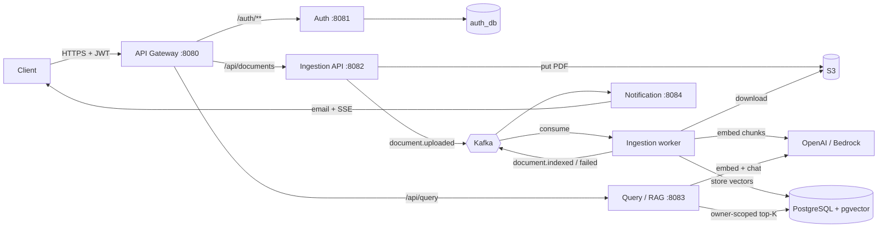

# DocuMind

**Ask questions about your PDFs and get answers that cite the page they came from.**
A retrieval-augmented generation (RAG) platform built as five Spring Boot microservices, connected by Kafka, storing vectors in PostgreSQL + pgvector, deployable to AWS ECS Fargate.

```
Java 17 · Spring Boot 3.5 · Spring Cloud Gateway · Spring Security (RS256 JWT) · Spring AI 1.1
Kafka (KRaft) · PostgreSQL 16 + pgvector (HNSW) · Amazon S3 · Flyway · Testcontainers
Docker · AWS ECS Fargate / RDS / MSK / Secrets Manager · GitHub Actions (OIDC)
```

## Architecture



**Write path (async):** upload → S3 + `documents` row (`UPLOADED`) → `document.uploaded` → worker extracts text per page, splits into ~800-token chunks, embeds, stores in `vector_store` → `document.indexed` → email + live SSE push.
**Read path (sync):** question → embedding → pgvector similarity search filtered by `owner_id` → grounded prompt with numbered context → LLM → answer with `[n]` citations and page numbers.

| Service | Port | Responsibility |
| --- | --- | --- |
| `gateway-service` | 8080 | Only public entry point: JWT check against JWKS, routing, CORS, `X-Request-Id` |
| `auth-service` | 8081 | Users (BCrypt), RS256 JWT issuing, `/.well-known/jwks.json` |
| `ingestion-service` | 8082 | Upload API + Kafka worker: parse, chunk, embed, store; retries and dead-letter topic |
| `query-service` | 8083 | RAG: retrieval, prompt, LLM call, citations, SSE streaming |
| `notification-service` | 8084 | Email (Mailpit locally, SES on AWS) and SSE push, idempotent |
| `common` | – | Kafka event records and the request-id filter |

## Run locally

Prerequisites: JDK 17, Maven 3.9+, Docker Desktop, an OpenAI API key.

```bash
cp .env.example .env            # then put your OPENAI_API_KEY in .env
scripts/gen-keys.sh             # RS256 key pair for JWT signing -> secrets/
cd infra && docker compose -f docker-compose.yml -f docker-compose.apps.yml up -d --build
cd .. && scripts/e2e.sh         # register -> upload -> wait for INDEXED -> ask -> assert citation
```

| UI | URL |
| --- | --- |
| API (gateway) | http://localhost:8080 |
| Kafka UI | http://localhost:8090 |
| Mailpit (emails) | http://localhost:8025 |
| Jaeger (traces) | http://localhost:16686 |

**Ports already taken?** Create `infra/.env` with any of `PG_PORT`, `KAFKA_PORT`, `KAFKA_UI_PORT`, `GATEWAY_PORT`, then pass the gateway port to the script: `BASE_URL=http://localhost:18080 scripts/e2e.sh`.

**Developing one service from the IDE:** start only the infrastructure (`docker compose up -d` in `infra/`), then run a service with `mvn -pl auth-service spring-boot:run`. Every connection setting has an env var with a localhost default (`DB_PORT`, `KAFKA_BOOTSTRAP`, `AUTH_URL`, ...).

### Try the API by hand

```bash
curl -X POST localhost:8080/auth/register -H 'Content-Type: application/json' \
  -d '{"email":"me@example.com","password":"Passw0rd!","fullName":"Me"}'
TOKEN=$(curl -s -X POST localhost:8080/auth/login -H 'Content-Type: application/json' \
  -d '{"email":"me@example.com","password":"Passw0rd!"}' | sed -n 's/.*"accessToken":"\([^"]*\)".*/\1/p')

curl -N -H "Authorization: Bearer $TOKEN" localhost:8080/api/notifications/stream &   # live status events
curl -H "Authorization: Bearer $TOKEN" -F file=@samples/sample.pdf localhost:8080/api/documents
curl -H "Authorization: Bearer $TOKEN" localhost:8080/api/documents
curl -H "Authorization: Bearer $TOKEN" -H 'Content-Type: application/json' localhost:8080/api/query \
  -d '{"question":"How many days notice is needed to terminate?"}'
curl -N -H "Authorization: Bearer $TOKEN" "localhost:8080/api/chat/stream?q=What%20are%20the%20payment%20terms"
```

| Method + path | Description |
| --- | --- |
| `POST /auth/register`, `POST /auth/login`, `GET /auth/me` | Accounts and tokens |
| `POST /api/documents` (multipart `file`) | Upload a PDF (≤ 25 MB); returns `202` while indexing runs |
| `GET /api/documents`, `GET /api/documents/{id}`, `DELETE /api/documents/{id}` | The caller's documents and status |
| `POST /api/query` `{question, documentIds?, topK?}` | Answer + sources (`fileName`, `page`, `score`, `snippet`) |
| `GET /api/chat/stream?q=...` | SSE: `sources`, then `token` events, then `done` |
| `GET /api/notifications/stream` | SSE: `document.indexed` / `document.failed` (token may also be `?access_token=`) |

## Design decisions and trade-offs

- **Kafka between upload and indexing.** Upload returns in milliseconds; parsing and embedding can take minutes and are retried independently. The document id is the message key, so all events for one document stay ordered on one partition.
- **Publish after commit.** `document.uploaded` is sent from a `@TransactionalEventListener(AFTER_COMMIT)`, so consumers never see an event for a rolled-back row. The remaining gap (commit succeeds, send fails) is what a transactional outbox would close — listed in the roadmap.
- **At-least-once + idempotency.** The worker deletes a document's vectors before re-adding them; the notification service records processed events so a redelivery never sends a second email.
- **Failures are explicit.** Transient errors retry with exponential backoff; bad PDFs are not retried. After retries the document is marked `FAILED`, `document.failed` is emitted, and the record is parked on `document.uploaded.DLT` for replay.
- **pgvector instead of a dedicated vector DB.** One PostgreSQL holds metadata and vectors (HNSW, cosine). Fewer moving parts; good to millions of chunks.
- **Query reads the vector table directly** with a read-only role: the table is a deliberately shared read model, avoiding a synchronous hop through ingestion on every question.
- **Tenant isolation lives in the retrieval filter.** Every similarity search is filtered by `owner_id` from the verified JWT; tests prove one user's chunks never reach another user's prompt.
- **Defence in depth for auth.** The gateway validates the RS256 JWT against auth's JWKS, and every service validates it again, so a request that bypasses the gateway inside the VPC still fails.
- **Grounded answers.** The system prompt forbids outside knowledge and requires `[n]` citations; with no relevant chunk the LLM is not called at all.
- **Provider-agnostic AI.** Spring AI abstracts the model: the `bedrock` profile switches to Bedrock Converse + Titan embeddings (authenticated by the ECS task role, so no API key is stored).

## Tests

`mvn verify` runs 26 integration tests (Docker must be running): Testcontainers PostgreSQL/pgvector and LocalStack S3, an embedded KRaft Kafka broker, a deterministic fake embedding model and a stub chat model, so the suite costs nothing and is repeatable. JaCoCo reports land in `*/target/site/jacoco/`.

| Service | Covers |
| --- | --- |
| auth | register/login, token verifies against JWKS, 409 duplicate, identical 401s (no user enumeration), validation |
| gateway | 401 without token, public login, routing, `X-Request-Id` |
| ingestion | upload → S3 → Kafka → chunks with page numbers → `document.indexed`; corrupt PDF → `FAILED` + `document.failed` + DLT; non-PDF rejected; owner isolation; delete removes vectors |
| query | cited answers, owner isolation, `documentIds` filter, LLM skipped without context, SSE ordering, validation |
| notification | one email per event despite redelivery, failure email, SSE push, auth |

## Deploying to AWS

Target: ECS Fargate in private subnets behind an ALB (gateway only), RDS PostgreSQL 16 with `CREATE EXTENSION vector`, Amazon MSK (TLS), S3, ECR, Secrets Manager, CloudWatch Logs, SES.

1. Create the infrastructure (VPC, RDS, MSK, S3, ECR repos `documind/<service>`, ECS cluster `documind` with a Service Connect namespace, IAM roles `documind-ecs-execution` and `documind-<alias>-task`).
2. Run `infra/init-db.sql` against RDS, and store secrets under `documind/db`, `documind/jwt`, `documind/openai`, `documind/ses`.
3. Replace the `<PLACEHOLDERS>` in `infra/ecs/*.json`, register them and create the five services (auth first, gateway last, Service Connect enabled).
4. Add an IAM OIDC provider for GitHub, a deploy role trusted only for this repo's `main`, and the secret `AWS_DEPLOY_ROLE_ARN`. From then on every green build on `main` deploys (`.github/workflows/deploy.yml`).
5. `BASE_URL=https://<alb-or-domain> scripts/e2e.sh`

Cost note: NAT gateway, ALB, RDS, MSK brokers and five tasks run roughly $150–200/month if left on; tear down between demos.

## Roadmap

Transactional outbox · OCR for scanned PDFs (Textract) · hybrid search (pgvector + `tsvector`) and re-ranking · refresh tokens · rate limiting on `/api/query` (Redis) · conversation memory · React front end · Terraform for the AWS stack.
