# DocuMind: The Complete Beginner's Guide

> **Who this is for:** anyone who wants to understand how DocuMind works, from the moment a user uploads a PDF to the moment they get an answer with a page citation. No prior knowledge of Spring, Kafka, vectors or AI is assumed. Every technology is explained: **what it is**, **why the project needs it**, and **where it lives in the code**.
>
> **How to read it:** sections 1 to 4 build the mental model. Section 5 walks through every user journey step by step. Sections 6 onward are the reference: each service file by file, data, configuration, security, reliability, running, testing and deployment. A glossary sits at the end; look up any unfamiliar word there.
>
> Diagrams use [Mermaid](https://mermaid.js.org/). They render automatically on GitHub and in the VS Code / IntelliJ Markdown preview.

---

## Table of contents

1. [What DocuMind is](#1-what-documind-is)
2. [Concepts you need first](#2-concepts-you-need-first)
3. [The big picture: architecture](#3-the-big-picture-architecture)
4. [The technology stack, and why each piece is there](#4-the-technology-stack-and-why-each-piece-is-there)
5. [End-to-end flows, step by step](#5-end-to-end-flows-step-by-step)
6. [Project folder structure](#6-project-folder-structure)
7. [Service deep dives, file by file](#7-service-deep-dives-file-by-file)
8. [Data: databases, tables, Kafka topics, S3](#8-data-databases-tables-kafka-topics-s3)
9. [Configuration, profiles and environment variables](#9-configuration-profiles-and-environment-variables)
10. [Security model](#10-security-model)
11. [Reliability: retries, idempotency, dead letters](#11-reliability-retries-idempotency-dead-letters)
12. [Observability: health, metrics, logs, traces](#12-observability-health-metrics-logs-traces)
13. [Running it on your machine](#13-running-it-on-your-machine)
14. [Testing](#14-testing)
15. [CI/CD and deploying to AWS](#15-cicd-and-deploying-to-aws)
16. [Limitations and roadmap](#16-limitations-and-roadmap)
17. [Glossary](#17-glossary)

---

## 1. What DocuMind is

DocuMind lets a user **upload PDF files and ask questions about them in plain English**. It answers using only what is written in those PDFs, and every answer points to the file and page it came from.

**Example.** You upload a 40-page service contract and ask:

> *How many days notice is needed to terminate?*

DocuMind replies:

> *Either party may terminate with thirty (30) days written notice [1].*
> Source [1]: `contract.pdf`, page 1

### 1.1 The problem it solves

A large language model (LLM), such as the one behind ChatGPT, knows a lot about the world but has never seen *your* private files. Ask it about your contract and it will guess, sometimes inventing a confident but wrong answer. This is called **hallucination**.

You also cannot paste a 500-page document into every question. Models accept a limited amount of text per request, and sending everything every time is slow and expensive.

### 1.2 The solution: RAG (Retrieval-Augmented Generation)

DocuMind uses a technique called **RAG**. It has two halves:

1. **Prepare once (indexing).** When a PDF is uploaded, extract its text, cut it into small pieces called **chunks** (roughly a page or less each), and convert every chunk into a list of numbers called an **embedding** that captures its *meaning*. Store the chunks and embeddings in a database.
2. **Answer many times (retrieval + generation).** When a question arrives, turn the question into an embedding too. Find the few chunks whose meaning is closest to the question. Send only those chunks and the question to the LLM with the instruction: *answer using only this text, and cite it*.

The LLM no longer guesses. It reads five relevant paragraphs and summarises them, which is exactly what LLMs are good at.

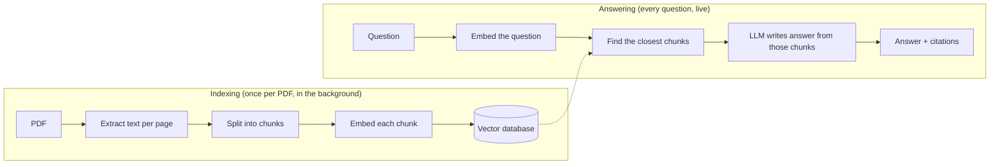

### 1.3 What a user can do

| Action | HTTP call | What happens |
| --- | --- | --- |
| Create an account | `POST /auth/register` | Saves the user with a hashed password |
| Log in | `POST /auth/login` | Returns a signed token (JWT) valid for 1 hour |
| See who I am | `GET /auth/me` | Reads identity from the token |
| Upload a PDF (max 25 MB) | `POST /api/documents` | Stores it, returns immediately with status `UPLOADED`; processing runs in the background |
| List my documents | `GET /api/documents` | Status of each: `UPLOADED` → `PROCESSING` → `INDEXED` or `FAILED` |
| See one document | `GET /api/documents/{id}` | Status, chunk count, error message if failed |
| Delete a document | `DELETE /api/documents/{id}` | Removes file, metadata and all its chunks |
| Ask a question | `POST /api/query` | Answer + numbered sources (file, page, score, snippet) |
| Ask and watch the answer type out | `GET /api/chat/stream?q=...` | Streams sources, then words as they are generated |
| Get live status updates | `GET /api/notifications/stream` | Pushes "your document is ready / failed" events |

The user also gets an **email** when a document finishes or fails.

A user can only ever see and search **their own** documents. This rule is enforced on every request (see [Security](#10-security-model)).

### 1.4 What kind of project this is

- A **backend only**. There is no web page yet; a React front end is on the roadmap. You use it with `curl`, Postman or a script.
- Written in **Java 17** using **Spring Boot**.
- Split into **five small services** (microservices) plus one shared library.
- Services talk to each other over **HTTP** and through a message system called **Kafka**.
- Runs on your laptop with **Docker**, and is deployable to **Amazon Web Services (AWS)**.

---

## 2. Concepts you need first

If any of these are already familiar, skip ahead. Each one is used throughout the guide.

### 2.1 Client, server, HTTP, REST and JSON

A **server** is a program that waits for requests. A **client** (a browser, `curl`, a mobile app) sends requests to it. They talk using **HTTP**: each request has a **method** (`GET` to read, `POST` to create, `DELETE` to remove), a **path** (`/api/documents`), **headers** (metadata such as `Authorization`) and an optional **body**.

The server replies with a **status code** and usually a body:

| Code | Meaning | Where DocuMind uses it |
| --- | --- | --- |
| 200 OK | Success | Login, list, query |
| 201 Created | Something new was created | Register |
| 202 Accepted | Accepted, work continues later | Upload (indexing runs in the background) |
| 204 No Content | Success, nothing to return | Delete |
| 400 Bad Request | Your input is invalid | Non-PDF upload, bad email format |
| 401 Unauthorized | Missing or invalid token / wrong password | No `Authorization` header |
| 404 Not Found | Does not exist (or is not yours) | Someone else's document id |
| 409 Conflict | Clashes with existing data | Registering an email twice |
| 502 / 503 | An upstream service failed / is busy | The AI provider rejected or rate-limited the call |

**REST** is a style of designing these APIs around resources (`/api/documents/{id}`) and HTTP methods. **JSON** is the text format for the bodies: `{"email":"me@example.com","password":"..."}`.

### 2.2 Monolith vs microservices

A **monolith** is one program that does everything. **Microservices** split the system into several small programs, each owning one job and its own data, that talk over the network.

DocuMind uses microservices because its jobs have very different needs:

- **Indexing** is slow (seconds to minutes per PDF) and CPU/network heavy. You may want ten copies of it.
- **Answering questions** must be fast and is called often.
- **Login** is tiny and security-critical.
- **Notifications** hold long-lived connections open.

Separate services can be scaled, deployed and fail independently. The price is more moving parts: networking, authentication between services, and messages that can be duplicated or delayed. Much of this guide explains how DocuMind pays that price safely.

### 2.3 Synchronous vs asynchronous

- **Synchronous:** the client waits for the full result. Asking a question is synchronous: you wait about 1 to 3 seconds and get the answer.
- **Asynchronous:** the client gets an immediate "accepted" and the work happens later. Uploading is asynchronous: you get `202 Accepted` in milliseconds and indexing finishes in the background.

Why? Parsing and embedding a large PDF can take minutes. Holding an HTTP request open that long is fragile (timeouts, dropped connections) and wastes server threads.

### 2.4 Message broker (Kafka) and events

To hand background work from one service to another, DocuMind uses a **message broker**, Apache Kafka. Think of it as a durable, ordered set of mailboxes:

- A **producer** writes a **message** (here called an **event**, a fact like "document X was uploaded") to a **topic** (a named mailbox, e.g. `document.uploaded`).
- A **consumer** reads messages from a topic and acts on them.
- Kafka keeps messages on disk, so if the consumer is down the messages wait for it.

This **decouples** services: the upload API does not need to know who processes uploads, or whether they are running right now.

### 2.5 Database, SQL, tables

A **relational database** (DocuMind uses PostgreSQL) stores data in **tables** of rows and columns, queried with **SQL**. A **transaction** groups several changes so they all succeed or all roll back. A **migration** is a versioned script that creates or changes tables.

### 2.6 Object storage (S3)

Large files (the PDFs) do not belong in a database. **Object storage** such as Amazon S3 stores files ("objects") in **buckets** under a **key** (a path-like name). It is cheap, durable and effectively unlimited. Locally, a tool called **LocalStack** imitates S3.

### 2.7 Embeddings, vectors and similarity

An **embedding model** turns text into a **vector**: a list of numbers, e.g. 1,536 of them. Texts with similar meaning get vectors that point in similar directions, even if they share no words:

- "terminate the agreement with 30 days notice"
- "how long before I can cancel the contract?"

These two land close together. **Cosine similarity** measures how close two vectors point (1 = same direction, 0 = unrelated). A **vector database** stores vectors and finds the nearest ones to a query vector fast. DocuMind uses PostgreSQL with the **pgvector** extension for this.

### 2.8 LLM, prompt and tokens

An **LLM** (large language model) generates text from a **prompt**. A **system prompt** sets the rules ("answer only from the context"); a **user prompt** carries the actual question and context. Text is measured in **tokens** (roughly ¾ of a word); providers charge per token and limit tokens per request. **Temperature** controls randomness; DocuMind uses a low 0.1 for factual, consistent answers.

### 2.9 Authentication, passwords and JWT

- **Authentication** = proving who you are. **Authorization** = what you may do.
- Passwords are never stored. A **hash** (here **BCrypt**) is stored instead: a one-way scramble that can be checked but not reversed.
- After login, the server gives the client a **JWT (JSON Web Token)**: a small signed document saying "this is user 123, email x, valid until 14:00". The client sends it on every request in the header `Authorization: Bearer <token>`.
- The token is **signed** with a **private key** that only the auth service has. Anyone with the matching **public key** can verify the signature, but cannot create new tokens. This is called **RS256** (RSA signature with SHA-256).
- A **JWKS** (JSON Web Key Set) is a URL where the auth service publishes its public key so other services can fetch it.

Because the token carries everything needed, services do not need to call the auth service or a session store on every request. This is **stateless** authentication.

### 2.10 Containers and Docker

A **container** packages a program with everything it needs (Java runtime, libraries) so it runs the same on any machine. **Docker** builds and runs containers from a recipe called a **Dockerfile**. An **image** is the built package; a **container** is a running instance. **Docker Compose** starts many containers together from one YAML file.

### 2.11 Spring Boot in one paragraph

**Spring** is the most widely used Java framework for server applications. **Spring Boot** makes Spring quick to start: you add a "starter" dependency (e.g. web, security, Kafka) and Boot **auto-configures** sensible defaults from `application.yml`. Key ideas you will see in the code:

- **Bean:** an object Spring creates and manages. Classes marked `@Component`, `@Service`, `@RestController` or methods marked `@Bean` become beans.
- **Dependency injection:** a class declares what it needs in its constructor (e.g. `DocumentService(S3Client s3, ...)`) and Spring passes it in. You never call `new S3Client()` yourself, which makes swapping and testing easy.
- **Annotations:** `@GetMapping("/x")` maps an HTTP route to a method; `@Transactional` wraps a method in a database transaction; `@KafkaListener` turns a method into a Kafka consumer.

---

## 3. The big picture: architecture

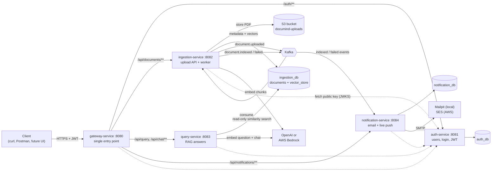

### 3.1 The five services and the shared library

| Module | Port | One-line job | Owns |
| --- | --- | --- | --- |
| `gateway-service` | 8080 | The only public door: checks the token, routes the request, adds a request id, handles CORS | nothing (stateless) |
| `auth-service` | 8081 | Register, log in, issue signed JWTs, publish the public key | `auth_db.users` |
| `ingestion-service` | 8082 | Upload API **and** background worker: store PDF, parse, chunk, embed, save vectors | `ingestion_db.documents`, `ingestion_db.vector_store`, S3 bucket |
| `query-service` | 8083 | Answer questions: find relevant chunks, ask the LLM, return citations | nothing (reads `vector_store` read-only) |
| `notification-service` | 8084 | React to "indexed / failed" events: send email, push live updates | `notification_db.processed_events` |
| `common` | – | Shared Java library: event classes, topic names, request-id filter | – |

### 3.2 The supporting infrastructure

| Component | What it is | Local stand-in | AWS service |
| --- | --- | --- | --- |
| PostgreSQL 16 + pgvector | Relational database that can also store and search vectors | `pgvector/pgvector:pg16` container | Amazon RDS |
| Kafka | Message broker | `apache/kafka:3.9.0` container (KRaft mode) | Amazon MSK |
| S3 | File storage for PDFs | LocalStack container | Amazon S3 |
| SMTP email | Sending emails | Mailpit (catches all mail, shows it in a web UI) | Amazon SES |
| Tracing backend | Shows request timelines across services | Jaeger | (tracing off by default) |
| Kafka UI | Web page to browse topics and messages | `provectuslabs/kafka-ui` | – |
| LLM provider | Embeddings + chat | OpenAI API | OpenAI, or Amazon Bedrock |

### 3.3 The two main paths

**Write path (asynchronous), when you upload:**

upload → PDF to S3 + `documents` row with status `UPLOADED` → event `document.uploaded` on Kafka → worker downloads the PDF, extracts text per page, splits into ~800-token chunks, embeds them, stores them in `vector_store` → status `INDEXED` → event `document.indexed` → email + live push.

**Read path (synchronous), when you ask:**

question → embed the question → pgvector similarity search **filtered to your own chunks** → numbered context in a prompt → LLM → answer with `[n]` citations and page numbers.

### 3.4 Why it is shaped this way

- **One public door (gateway).** Clients only need one URL. Security checks, CORS and request ids happen in one place. On AWS, only the gateway sits behind the public load balancer; the rest are in private networks.
- **Kafka between upload and indexing.** Upload returns in milliseconds. Indexing can be slow, retried and scaled without the user waiting. If the worker crashes, the message waits in Kafka.
- **Each service owns its own database.** `auth_db`, `ingestion_db` and `notification_db` are separate databases (on one PostgreSQL server locally), so they could later be moved to separate servers without code changes.
- **One deliberate exception:** the query service reads ingestion's `vector_store` table directly, using a **read-only** database user. The alternative, asking ingestion over HTTP on every question, would add a network hop and couple query latency to ingestion's load. This is called a **shared read model**, and it is documented as a conscious trade-off.
- **Notification is separate** so that a slow email server, or many open live connections, can never slow down uploads or answers.

---

## 4. The technology stack, and why each piece is there

Each entry answers three questions: **What is it? Why does DocuMind need it? Where is it used?**

### 4.1 Language and build

#### Java 17
- **What:** a widely used, strongly typed programming language running on the JVM (Java Virtual Machine).
- **Why:** mature, fast, excellent libraries for every piece here (Kafka, PostgreSQL, AWS, AI). Version 17 is a **Long-Term Support** release and adds **records** (`public record DocumentDto(...)`, compact immutable data classes), pattern matching (`if (value instanceof Number n)`), and text blocks (`"""..."""`, used for prompts and email bodies).
- **Where:** every `.java` file.

#### Maven (multi-module)
- **What:** Java's build tool. It downloads libraries ("dependencies"), compiles, runs tests and packages `.jar` files, driven by `pom.xml` files.
- **Why multi-module:** one root `pom.xml` lists six **modules** (`common` + five services). Versions of every library are set **once** in the root, so all services use identical, compatible versions.
- **BOMs (Bills of Materials):** the root imports BOMs from Spring Boot, Spring Cloud, Spring AI, AWS SDK and Testcontainers. A BOM is a curated list of versions known to work together. Note the comment in `pom.xml`: the AWS BOM is imported **first** because when two BOMs manage the same library, the first one wins.
- **Where:** `pom.xml` (root), `*/pom.xml`.

#### Lombok
- **What:** a compile-time code generator.
- **Why:** removes boilerplate. `@Getter` writes getters, `@RequiredArgsConstructor` writes the constructor for all `final` fields (which is how Spring injects dependencies), `@Slf4j` creates a `log` field.
- **Where:** most classes. It is excluded from the final jar because it is only needed at compile time.

### 4.2 Spring ecosystem

#### Spring Boot 3.5
- **What:** framework that auto-configures a production-ready Java server from dependencies plus `application.yml`.
- **Why:** you write business logic; Boot provides the web server, database connection pool, Kafka clients, security filters, health checks, metrics and config loading.
- **Where:** each service's `*Application.java` (`@SpringBootApplication` + `main`).

#### Spring Web MVC (servlet stack)
- **What:** the classic Spring web layer. `@RestController` classes handle HTTP requests; each request runs on a thread from Tomcat's pool.
- **Why:** simple, well understood, works naturally with JDBC/JPA (which block threads).
- **Where:** auth, ingestion, query and notification services (`spring-boot-starter-web`).

#### Spring Cloud Gateway (WebFlux, reactive)
- **What:** an API gateway library. Routes are declared in YAML: "requests whose path matches `/api/documents/**` go to `http://ingestion:8082`".
- **Why reactive:** a gateway mostly waits on network I/O. The reactive engine (Netty + Project Reactor) handles thousands of concurrent connections with a few threads, ideal for proxying and for long-lived streams.
- **Where:** `gateway-service`. You will see `Mono` and `ServerWebExchange` there; `Mono` means "a value that will arrive later".

#### Spring Security + OAuth2 Resource Server
- **What:** Spring's security framework. The "resource server" part knows how to read a `Bearer` token, verify its signature against a public key, check expiry and issuer, and expose the user to your code.
- **Why:** token checking is security-critical code you should not write yourself.
- **Where:** a `SecurityConfig` class in every service. `@AuthenticationPrincipal Jwt jwt` in a controller gives you the verified token.

#### Nimbus JOSE + JWT
- **What:** the library Spring Security uses under the hood to create and verify JWTs and JWK sets.
- **Where:** `auth-service/.../JwtKeyConfig.java` (`RSAKey`, `JWKSet`, `NimbusJwtEncoder`).

#### BCrypt
- **What:** a password hashing algorithm that is intentionally slow and salted.
- **Why:** if the database leaks, attackers cannot reverse the hashes, and the slowness makes guessing billions of passwords impractical. Note the password length limit of 72 in `AuthDtos`: BCrypt ignores anything past 72 bytes, so the API refuses longer passwords rather than silently truncating them.
- **Where:** `auth-service/.../SecurityConfig.java` (`BCryptPasswordEncoder`).

#### Spring Data JPA + Hibernate
- **What:** **JPA** maps Java classes to tables (`@Entity class User` ↔ table `users`). **Hibernate** is the implementation. **Spring Data** generates queries from method names: `findByEmail(String email)` becomes `SELECT ... WHERE email = ?` automatically.
- **Why:** less SQL to hand-write for simple create/read/update.
- **Where:** `User` + `UserRepository` (auth), `DocumentRecord` + `DocumentRepository` (ingestion).
- **Two settings worth knowing:** `ddl-auto: validate` means Hibernate never changes tables, it only checks they match the classes (Flyway owns the schema). `open-in-view: false` closes the database session when the service method ends, avoiding hidden queries during JSON rendering.

#### JdbcTemplate
- **What:** a thin helper to run plain SQL.
- **Why:** the notification service needs two tiny queries; JPA would be overkill.
- **Where:** `notification-service/.../ProcessedEventStore.java`.

#### Jakarta Bean Validation
- **What:** annotations such as `@NotBlank`, `@Email`, `@Size(max=2000)`, `@Min(1)` on request classes. With `@Valid`, Spring rejects invalid input with `400` before your code runs.
- **Where:** `AuthDtos`, `QueryDtos`, `QueryController`.

#### ProblemDetail (RFC 7807 / 9457)
- **What:** a standard JSON shape for errors: `{"type":..., "title":"Not Found", "status":404, "detail":"Document ... not found"}`.
- **Why:** clients get consistent, machine-readable errors from every service.
- **Where:** each `GlobalExceptionHandler` (`@RestControllerAdvice`) maps an exception class to a status code.

#### Spring Boot Actuator
- **What:** ready-made operational endpoints: `/actuator/health` (is it up?), `/actuator/health/readiness` and `/liveness` (Kubernetes/ECS-style probes), `/actuator/prometheus` (metrics).
- **Why:** Docker Compose and AWS use the health endpoints to know when a service is ready and to restart broken ones.

### 4.3 Data and storage

#### PostgreSQL 16
- **What:** a powerful open-source relational database.
- **Why:** reliable and familiar; with an extension it also serves as the vector database, so the project needs only one database technology.

#### pgvector (with an HNSW index)
- **What:** a PostgreSQL extension adding a `VECTOR(n)` column type and distance operators. **HNSW** (Hierarchical Navigable Small World) is an index that finds approximate nearest neighbours very fast, without comparing against every row.
- **Why not a dedicated vector database** (Pinecone, Weaviate, Qdrant)? One PostgreSQL holds both metadata and vectors: fewer services to run, pay for, back up and secure, and it comfortably handles millions of chunks. The index uses **cosine distance** (`vector_cosine_ops`), matching how OpenAI embeddings are meant to be compared.
- **Where:** `ingestion-service/src/main/resources/db/migration/V2__vector_store.sql`.

#### Flyway
- **What:** a database migration tool. Files named `V1__users.sql`, `V2__vector_store.sql` run once, in order, at startup; Flyway records which ones already ran in a history table.
- **Why:** the database schema is versioned with the code. Every environment (your laptop, tests, AWS) ends up identical, automatically.
- **Where:** `*/src/main/resources/db/migration/`. Note the placeholder `${embedding_dimensions}` in V2: the vector column size comes from config, because different embedding models produce different sizes (1,536 for OpenAI `text-embedding-3-small`, 1,024 for Amazon Titan V2).

#### Amazon S3 (and LocalStack locally)
- **What:** object storage for the uploaded PDFs.
- **Why:** PDFs can be 25 MB; databases are a poor and expensive place for large files. S3 is cheap and durable. The worker downloads the file from S3 later, so the Kafka message stays small (it only carries the S3 key).
- **Where:** `ingestion-service/.../S3Config.java`, `DocumentService.upload` (put), `IngestionWorker` (get), `DocumentService.delete` (delete). Locally, `S3_ENDPOINT=http://localhost:4566` points the AWS SDK to LocalStack; on AWS the endpoint is empty and the real S3 is used.

#### AWS SDK for Java v2
- **What:** Amazon's official Java client library.
- **Where:** `S3Client` in ingestion. On AWS it authenticates automatically using the container's **IAM task role**, so no AWS keys are stored.

### 4.4 Messaging

#### Apache Kafka 3.9 (KRaft mode)
- **What:** a distributed, durable, ordered log of messages. **KRaft** mode means Kafka manages itself without the older ZooKeeper dependency, so one container is enough locally.
- **Why Kafka here:**
  - **Decoupling:** upload does not wait for indexing.
  - **Durability:** if the worker is down, uploads still succeed and are processed when it returns.
  - **Fan-out:** the `document.indexed` event is read by the notification service; future services (analytics, audit) can subscribe without touching ingestion.
  - **Ordering by key:** the document id is used as the message **key**, so all events for one document go to the same **partition** and are read in order.
  - **Scaling:** topics have 3 partitions, so up to 3 worker threads (or instances) can process different documents in parallel.
- **Where:** topics are named in `common/.../Topics.java` and created at startup by `ingestion-service/.../KafkaConfig.java`.

#### Spring for Apache Kafka (spring-kafka)
- **What:** Spring integration for Kafka. `KafkaTemplate.send(...)` produces; `@KafkaListener` consumes. It also provides retry with back-off and **dead-letter** publishing.
- **Serialization:** events are Java records converted to JSON (`JsonSerializer` / `JsonDeserializer`). `spring.json.trusted.packages: com.documind.common.events` restricts which classes may be created from incoming JSON, a safety measure. `ErrorHandlingDeserializer` wraps deserialization so one malformed message is sent to the error handler instead of crashing the consumer in a loop.

### 4.5 AI

#### Spring AI 1.1
- **What:** Spring's abstraction over AI providers. Your code uses neutral interfaces:
  - `EmbeddingModel`: text → vector
  - `ChatClient` / `ChatModel`: prompt → answer (whole, or streamed token by token)
  - `VectorStore`: add documents (it embeds them for you), similarity search with metadata filters, delete by filter
  - `Document`: a piece of text + a metadata map
  - `PagePdfDocumentReader`: PDF → one `Document` per page (uses Apache PDFBox inside)
  - `TokenTextSplitter`: long text → chunks of N tokens
- **Why:** the code is **provider-agnostic**. Switching from OpenAI to Amazon Bedrock is a configuration change (the `bedrock` profile), not a code change. Spring AI also adds automatic retries on transient AI errors (`spring.ai.retry`: 3 attempts with back-off).
- **Where:** `PdfChunker`, `IngestionWorker`, `DocumentService.delete` (ingestion); `RetrievalService`, `RagService`, `AiConfig` (query).

#### OpenAI (default provider)
- **Embedding model:** `text-embedding-3-small` (1,536 dimensions). Cheap and good quality.
- **Chat model:** `gpt-4o-mini`, temperature 0.1. Fast and inexpensive, more than enough to summarise five retrieved chunks.
- `OPENAI_BASE_URL` can point to any OpenAI-compatible server (for example a local model server).

#### Amazon Bedrock (optional provider)
- Bedrock **Converse** API for chat (model chosen with `BEDROCK_CHAT_MODEL`), **Titan Text Embeddings V2** (1,024 dimensions) for embeddings.
- **Why offer it:** on AWS it authenticates with the container's IAM role, so no API key is stored anywhere, and data stays in your AWS account.
- **Important:** vectors from different models are not comparable. Switching models requires a fresh `vector_store` (and `EMBEDDING_DIMENSIONS=1024`) and re-indexing.

### 4.6 Real-time delivery

#### Server-Sent Events (SSE)
- **What:** a simple standard where the server keeps an HTTP response open and writes events into it over time (`event: token`, `data: ...`). Browsers support it natively via `EventSource`.
- **Why SSE instead of WebSockets:** the data only flows server → client, which is exactly SSE's model. It is plain HTTP, so it passes through the gateway and load balancers with no special setup.
- **Where:**
  - `query-service`: `/api/chat/stream` streams the answer word by word (`Flux<ServerSentEvent>` from Project Reactor).
  - `notification-service`: `/api/notifications/stream` pushes document status (`SseEmitter` from Spring MVC).
- Because browsers' `EventSource` cannot set an `Authorization` header, these streams also accept the token as `?access_token=...`.

#### Project Reactor (`Flux`, `Mono`)
- **What:** Java's reactive streams library. `Flux` = 0..N values arriving over time; `Mono` = 0..1 value.
- **Where:** the gateway (all of it) and the query stream endpoint, where the LLM's tokens are a `Flux<String>`.

### 4.7 Email

#### Spring Mail (JavaMailSender), Mailpit, Amazon SES
- **What:** sending email over **SMTP**. Locally, **Mailpit** pretends to be a mail server and shows every email at http://localhost:8025 (nothing is actually delivered). On AWS, the same code talks to **Amazon SES**'s SMTP endpoint.
- **Why an `EmailSender` interface:** the listener code depends on the interface, not on SMTP, so tests use a fake and the transport could be swapped for the SES SDK later.

### 4.8 Observability

| Tool | What it gives you | Where |
| --- | --- | --- |
| **Micrometer** + Prometheus registry | Numeric metrics (counters, timers) at `/actuator/prometheus` | Custom: `documind.ingestion.duration`, `documind.chunks.created`, `documind.query.latency`, `documind.llm.tokens` |
| **Micrometer Tracing + OpenTelemetry** | A trace id that follows one request across services, including through Kafka | `management.tracing` in each `application.yml` |
| **Jaeger** | Web UI showing each trace as a timeline (local only) | http://localhost:16686 |
| **X-Request-Id** | A simple correlation id added by the gateway and logged by every service | `RequestIdGlobalFilter`, `RequestIdFilter` |
| **Structured logs (ECS JSON)** | Machine-readable logs in Docker / AWS profiles, easy to search in CloudWatch | `application-docker.yml`, `application-aws.yml` |

### 4.9 Containers, testing and delivery

| Technology | What | Why here |
| --- | --- | --- |
| **Docker** (multi-stage `Dockerfile`) | Builds one image per service from a single Dockerfile using `--build-arg MODULE=...` | Same artifact runs locally and on AWS |
| **Docker Compose** | Starts infra + services together | One command for a full local environment |
| **JUnit 5** | Java test framework | All tests |
| **Testcontainers** | Starts real PostgreSQL (with pgvector) and LocalStack in Docker during tests | Tests hit real databases, not mocks |
| **Embedded Kafka** (`@EmbeddedKafka`) | An in-process Kafka broker for tests | Real Kafka behaviour without a container |
| **Awaitility** | "Wait until this becomes true, up to 60 s" | Testing asynchronous flows |
| **MockMvc / WebTestClient** | Call controllers in tests without a real network | Fast HTTP-level tests |
| **JaCoCo** | Code coverage reports | `*/target/site/jacoco/` |
| **GitHub Actions** | CI/CD: build, test, build images, deploy | `.github/workflows/` |
| **AWS ECS Fargate** | Runs containers without managing servers | Production hosting |
| **Amazon ECR** | Private Docker image registry | Stores the built images |
| **AWS Secrets Manager** | Stores DB passwords, JWT keys, API keys | Injected as env vars at container start |
| **GitHub OIDC → AWS IAM role** | GitHub proves its identity to AWS with a short-lived token | No long-lived AWS keys stored in GitHub |

---

## 5. End-to-end flows, step by step

This is the heart of the guide. Each flow follows one user action through every service, naming the class and method that does each step.

### 5.1 Flow A: Register and log in

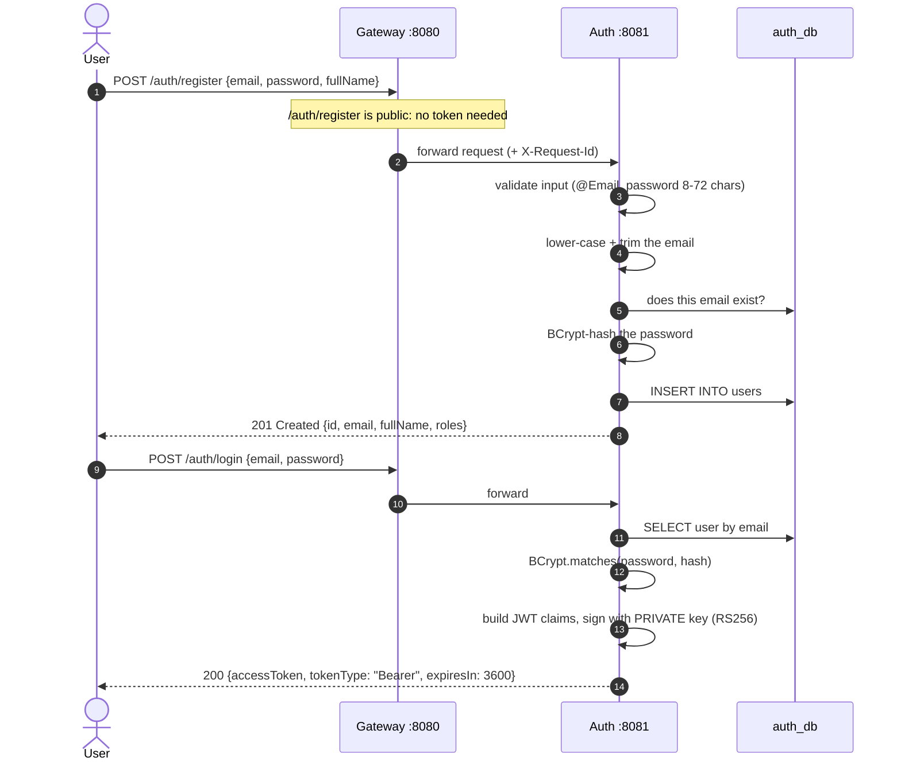

**Step by step:**

1. The client sends JSON to the gateway. The gateway's `SecurityConfig` lists `/auth/register` and `/auth/login` as public, so no token is required. The `/auth/**` route forwards it to the auth service.
2. `AuthController.register` receives a `RegisterRequest`. `@Valid` triggers the validation rules in `AuthDtos`; a bad email or short password returns `400` automatically.
3. `AuthService.register` normalises the email (`Alice@Example.com` → `alice@example.com`) so the same person cannot register twice with different capitalisation.
4. It checks `existsByEmail`. If taken → `EmailAlreadyUsedException` → `GlobalExceptionHandler` turns it into `409 Conflict`.
5. The password is hashed with BCrypt and `User.create(...)` builds the row with a random UUID and role `USER`. `saveAndFlush` writes it immediately.
   - **Race condition handled:** if two identical registrations arrive at the same instant, both may pass the `existsByEmail` check. The database's `UNIQUE` constraint on `email` rejects the second insert, and the `DataIntegrityViolationException` is converted into the same `409`.
6. **Login:** `AuthService.login` looks up the user and checks the password with `passwordEncoder.matches`.
   - **No user enumeration:** an unknown email and a wrong password both return the exact same `401 "Invalid credentials"`. Even the **timing** is equalised: when the email is unknown, the code still runs a BCrypt check against a dummy hash, so an attacker cannot tell "no such user" (fast) from "wrong password" (slow) by measuring response time.
7. `TokenService.issue` builds the JWT:

   | Claim | Value | Meaning |
   | --- | --- | --- |
   | `iss` | `documind-auth` | Who issued it; every service checks this |
   | `sub` | user's UUID | Who the token is about; used as the owner id everywhere |
   | `iat` / `exp` | now / now + 1 hour | Issued at / expires at |
   | `email`, `name` | from the user row | Used for emails and display |
   | `roles` | `["USER"]` | For future authorization rules |

   The header carries `alg: RS256` and `kid: documind-key-1` (the key id, so verifiers know which public key to use, which makes key rotation possible later).
8. The client stores `accessToken` and sends it as `Authorization: Bearer <token>` on every later request. After one hour it must log in again (refresh tokens are on the roadmap).

### 5.2 Flow B: What happens to every authenticated request

Before any business logic runs, every protected request goes through the same checks.

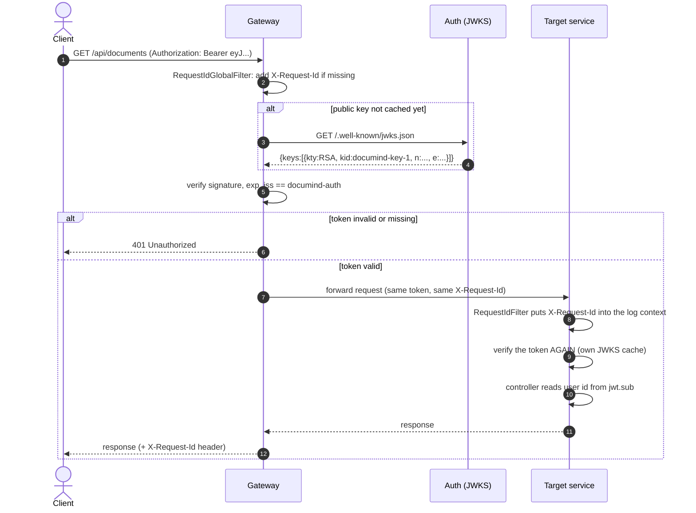

Key points:

- **Public key caching.** Each service downloads the JWKS once and caches it. Verifying a token is then pure local math: no network call per request.
- **Defence in depth.** The gateway checks the token, **and** every service checks it again. If an attacker somehow reaches a service directly inside the private network, bypassing the gateway, the request still fails.
- **Identity comes only from the token.** Services never trust a user id from the URL or body. `CurrentUser.from(jwt)` in ingestion reads `jwt.getSubject()`; the query service does the same. You cannot ask about someone else's documents by changing a parameter.
- **Request id.** One id follows the request through every service's logs, so you can search logs for one id and see the whole story.

### 5.3 Flow C: Upload a PDF (the fast, synchronous part)

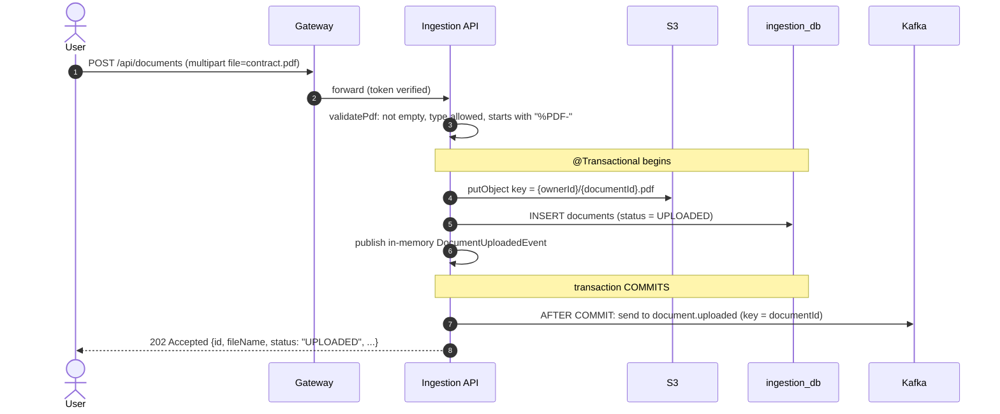

**Step by step** (`DocumentController.upload` → `DocumentService.upload`):

1. **Size limit.** Spring rejects files over 25 MB before your code runs (`spring.servlet.multipart.max-file-size: 25MB`).
2. **Validation** (`validatePdf`):
   - File must not be empty.
   - Content type must be `application/pdf`, `application/x-pdf` or `application/octet-stream` (some clients send the generic type).
   - **The bytes must begin with `%PDF-`.** This "magic number" check trusts the content, not the filename: a text file renamed to `.pdf` is rejected with `400`.
3. **Ids and names.** A new random UUID becomes the document id. The S3 key is `{ownerId}/{documentId}.pdf`, so files are grouped per user and never collide. `cleanFileName` strips any folder path a client might send (e.g. `C:\Users\x\file.pdf` → `file.pdf`) and caps length at 255.
4. **Store the file in S3**, then **save the metadata row** with status `UPLOADED`.
5. **Publish the event, but only after commit.** The service calls `events.publishEvent(new DocumentUploadedEvent(...))`. This is Spring's **in-memory** event bus, not Kafka yet. `DocumentEventRelay.onUploaded` is annotated `@TransactionalEventListener(phase = AFTER_COMMIT)`, so it runs only after the database transaction has successfully committed, and then sends the event to Kafka.
   - **Why:** if the event were sent first and the database insert then failed, the worker would receive an event for a document that does not exist. Waiting for commit guarantees consumers only ever see events for real rows.
   - **The remaining gap:** if the commit succeeds but the Kafka send fails (broker down at that exact moment), the document stays `UPLOADED` forever. The **transactional outbox** pattern (write the event into a table in the same transaction, then relay it) would close this gap; it is on the roadmap. The failure is logged.
6. **Message key = document id.** All events about one document land in the same partition, so they are processed in order.
7. **Reply `202 Accepted`.** The user has an id and can poll `GET /api/documents/{id}` or listen on the notification stream.

### 5.4 Flow D: Indexing in the background (the slow, asynchronous part)

```mermaid
sequenceDiagram
    autonumber
    participant K as Kafka
    participant W as IngestionWorker
    participant DB as ingestion_db
    participant S3 as S3
    participant P as PdfChunker
    participant AI as Embedding model
    participant VS as vector_store

    K->>W: document.uploaded {documentId, ownerId, s3Key, fileName, ...}
    W->>DB: UPDATE status = PROCESSING
    alt 0 rows updated (document was deleted)
        W->>W: skip silently
    end
    W->>S3: getObject(s3Key) -> PDF bytes
    W->>P: chunk(pdf, event)
    P->>P: read one Document per page (page_number)
    P->>P: drop blank pages; none left -> InvalidPdfException
    P->>P: split into ~800-token chunks
    P->>P: tag each chunk: owner_id, document_id, file_name, page_number, chunk_index
    P-->>W: List<Document>
    W->>VS: DELETE WHERE document_id = X   (idempotency)
    loop batches of 100 chunks
        W->>AI: embed 100 texts
        AI-->>W: 100 vectors
        W->>VS: INSERT content, metadata, embedding
    end
    W->>DB: UPDATE status = INDEXED, chunk_count = N
    W->>K: document.indexed {documentId, ownerId, ownerEmail, fileName, chunkCount}
```

**Step by step** (`IngestionWorker.handle` → `process`):

1. **Consume.** `@KafkaListener(topics = "document.uploaded", concurrency = 3)` runs three consumer threads in the consumer group `ingestion-workers`. Each thread owns one of the topic's three partitions, so up to three PDFs are processed in parallel per instance. Running a second instance would share the partitions between instances automatically.
2. **Mark `PROCESSING`.** `repo.updateStatus(...)` returns the number of rows changed. If it is `0`, the user deleted the document before the worker got to it, so the worker skips it.
3. **Download** the PDF bytes from S3 using the key carried in the event.
4. **Extract and chunk** (`PdfChunker.chunk`):
   - `PagePdfDocumentReader` with `pagesPerDocument(1)` produces **one `Document` per page**, each with `page_number` in its metadata. This is what makes page citations possible.
   - Pages with no text are dropped. If **no** page has text (a scanned image PDF), it throws `InvalidPdfException("No extractable text; scanned PDFs (OCR) are not supported yet")`.
   - If PDFBox cannot parse the file at all (corrupt), it also throws `InvalidPdfException`.
   - `TokenTextSplitter` cuts page text into chunks of about **800 tokens**, with a minimum of 350 characters, so chunks are big enough to carry meaning but small enough that five of them fit comfortably in a prompt. Because each page is split separately, every chunk stays inside one page and keeps the correct page number.
   - Each chunk gets fresh metadata: `owner_id`, `document_id`, `file_name`, `page_number`, `chunk_index`. **`owner_id` is the key to tenant isolation later.**
5. **Delete old vectors for this document first.** Kafka guarantees *at-least-once* delivery: a message can occasionally be delivered twice (e.g. the worker crashed after storing vectors but before acknowledging). Deleting first means a re-run **replaces** vectors instead of duplicating them. This makes the worker **idempotent**.
6. **Embed and store in batches of 100.** `vectorStore.add(batch)` calls the embedding model for the batch (one API call per 100 chunks, cheaper and faster than one per chunk) and inserts rows into `vector_store`. Batching also bounds memory and request size for very large PDFs.
7. **Mark `INDEXED`** with the chunk count, increment the `documind.chunks.created` metric, and publish **`document.indexed`**.
8. The whole `process` call is timed into the `documind.ingestion.duration` metric.

**Why `max.poll.interval.ms: 600000` (10 minutes)?** Kafka assumes a consumer is dead if it does not ask for new messages within this interval and reassigns its partitions. Embedding a big PDF can take minutes, so the limit is raised to avoid false "dead consumer" alarms.

**Why `ack-mode: record`?** The worker tells Kafka "done" after **each** message, so a crash re-delivers at most the one message in progress.

### 5.5 Flow E: When indexing fails

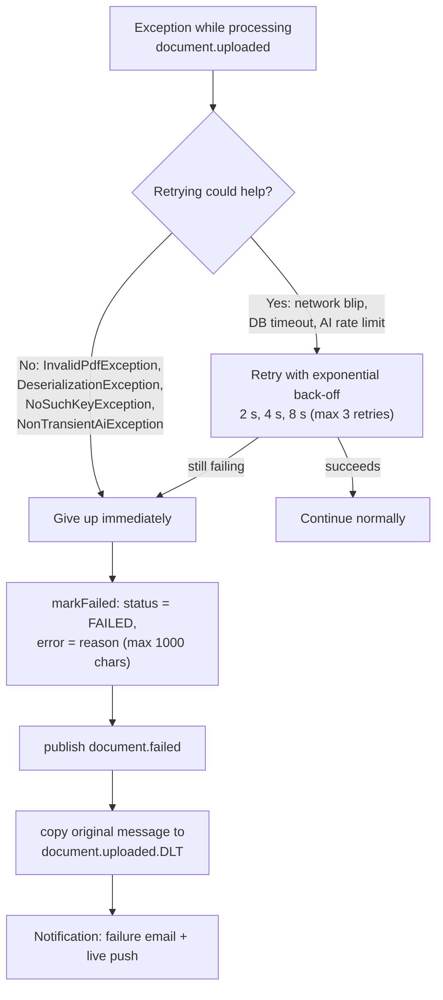

Configured in `KafkaConfig.kafkaErrorHandler`:

- **Two kinds of error.** Some errors are *transient* (a temporary network problem, the AI provider rate-limiting you): waiting and retrying usually works. Others are *permanent*: a corrupt PDF, an unreadable message, a missing S3 object, or a rejected API key. Retrying those only wastes time, so they are listed as **not retryable**.
- **Exponential back-off.** Retries wait 2 s, then 4 s, then 8 s. Increasing waits give a struggling dependency time to recover instead of hammering it.
- **Giving up is explicit, never silent:**
  1. `DocumentFailureHandler.markFailed` sets the row to `FAILED` with the reason (trimmed to 1,000 characters) so `GET /api/documents/{id}` shows the user what went wrong.
  2. It publishes **`document.failed`** so the user is emailed.
  3. The original message is copied to the **dead-letter topic** `document.uploaded.DLT`. An operator can inspect it in Kafka UI and replay it after fixing the cause.
- **Raw bytes in the DLT.** If a message could not even be deserialised, it is raw bytes, not an event object. The handler keeps a second `KafkaTemplate` that sends `byte[]` so even unreadable messages reach the DLT intact.
- **Spring AI has its own retry layer too** (3 attempts, 2 s → 20 s back-off) around each embedding call, so brief AI hiccups are absorbed before the Kafka-level retry is even needed.

### 5.6 Flow F: Ask a question (`POST /api/query`)

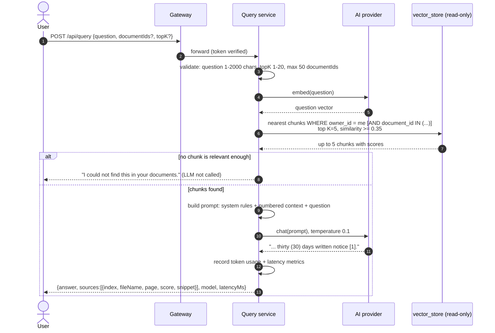

**Step by step** (`QueryController.query` → `RagService.ask`):

1. **Retrieve** (`RetrievalService.retrieve`):
   - Builds a **filter**: `owner_id == <my user id>`. If the request lists `documentIds`, adds `AND document_id IN (...)` to search only those documents.
   - **This filter is the tenant-isolation control.** Without it, Alice's question could pull chunks from Bob's documents into the prompt. The owner id comes from the verified token, so it cannot be forged. Tests prove that one user's chunks never reach another user's prompt.
   - `topK` defaults to 5, is clamped to 1..20.
   - `similarityThreshold` 0.35: chunks less similar than this are discarded, so an off-topic question does not get padded with irrelevant text.
   - Spring AI's `PgVectorStore` embeds the question with the same model used during indexing and runs one SQL query using the HNSW index.
2. **Nothing relevant?** The service returns *"I could not find this in your documents."* **without calling the LLM at all.** This saves money and removes any chance of a made-up answer.
3. **Build the prompt.** The **system prompt** is fixed:

   ```text
   You are DocuMind, an assistant that answers questions ONLY from the provided context.
   Rules:
   - Use only facts stated in the context. Do not use outside knowledge.
   - Cite every claim inline with the context number in square brackets, for example [1] or [2][3].
   - If the context does not contain the answer, reply exactly: "I could not find this in your documents."
   - Be concise.
   ```

   The **user message** looks like:

   ```text
   Context:
   [1] (contract.pdf, p.1)
   Either party may terminate this agreement with thirty (30) days written notice...

   [2] (contract.pdf, p.2)
   Invoices are issued monthly and payment is due within forty-five (45) days...

   Question: How many days notice is needed to terminate?
   ```

   - The numbers `[1]`, `[2]` let the LLM cite, and let the API map each citation back to a file and page.
   - The user message is passed as a `UserMessage` object, **not** a template string. PDF text can contain `{curly braces}`, which a template engine would try to interpret and crash on.
4. **Call the LLM** (`gpt-4o-mini` by default, temperature 0.1 for steady, factual output).
5. **Return** the answer, plus a `sources` list: index, document id, file name, page, similarity score, and a 300-character snippet so the user can verify the claim. Also returns which model answered and how long it took.
6. **Errors.** If the AI provider is still busy after Spring AI's retries → `503 "The AI service is busy right now"`. If it rejects the request (e.g. invalid key) → `502`.

### 5.7 Flow G: Streaming answer (`GET /api/chat/stream?q=...`)

Same retrieval and prompt as Flow F, but the response is a stream of **Server-Sent Events**, like ChatGPT typing:

```text
event: sources
data: [{"index":1,"fileName":"contract.pdf","page":1,...}]

event: token
data: Either

event: token
data:  party may terminate

...

event: done
data:
```

`RagService.stream` builds a `Flux` (a reactive stream) by concatenating: one `sources` event → every `token` the model streams back → one `done` event. Sources come **first** so a UI can show citation cards while the answer is still being written. If no chunk is relevant, the stream is simply `sources: []`, one `token` with the not-found message, then `done`.

`spring.mvc.async.request-timeout: 120s` on the query service gives a long answer up to two minutes to finish streaming.

### 5.8 Flow H: Notifications (email + live push)

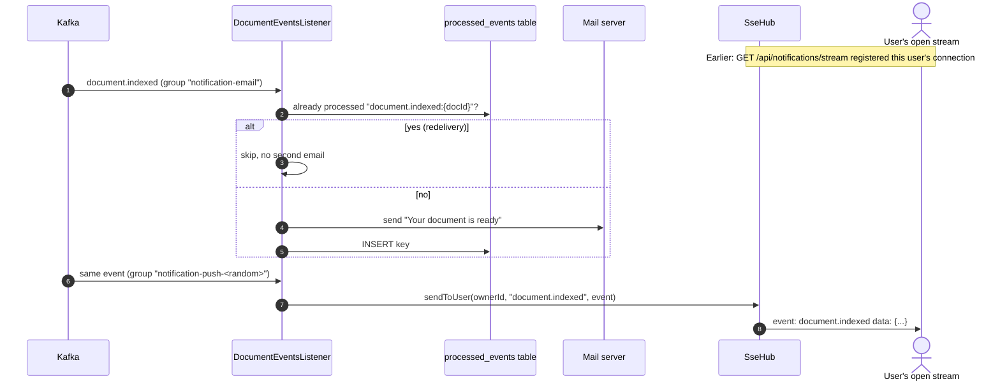

The notification service listens to `document.indexed` and `document.failed` in **two different consumer groups**, on purpose. To understand why, you need one Kafka rule: **within one consumer group, each message is delivered to only one member; different groups each get their own copy.**

1. **Email group: `notification-email` (shared by all instances).** If you run three notification instances, each event is handled by **one** of them, so the user gets **one** email, not three.
2. **Push group: `notification-push-<random UUID>` (unique per instance).** Each instance makes up its own group name at startup, so **every** instance receives **every** event. Why? A user's browser is connected to only one instance. Since we do not know which, every instance checks whether it holds a connection for that user and pushes if so. `auto.offset.reset=latest` means a newly started instance does not replay old history to live users.

**Email idempotency** (`ProcessedEventStore`): Kafka may redeliver an event. Before sending, the listener checks the `processed_events` table for the key `"document.indexed:<documentId>"`. After a **successful** send it inserts the key. Recording *after* sending means a failed send is retried rather than silently skipped. (A crash in the tiny window between sending and recording could still produce a duplicate; that is the accepted trade-off of at-least-once delivery.)

**Live push** (`SseHub`):

- `GET /api/notifications/stream` creates an `SseEmitter` (an open HTTP response) stored in a map `userId → list of connections` (a user may have several tabs open). It immediately sends a `connected` event.
- `sendToUser` writes the event to each of that user's open connections; broken ones are removed.
- A **heartbeat comment every 25 s** keeps idle connections alive. AWS load balancers close connections idle for 60 s by default.
- Connections expire after 30 minutes; clients (e.g. `EventSource`) reconnect automatically.
- `spring.mvc.async.request-timeout: -1` stops Spring from cutting the long-lived stream; the emitter's own timeout applies instead.
- Mail server health is excluded from the service's health check (`management.health.mail.enabled: false`) so that an email outage does not take the whole service out of the load balancer, and live pushes keep working.

### 5.9 Flow I: List, view and delete documents

- **List** (`GET /api/documents`): `findAllByOwnerIdOrderByCreatedAtDesc(me)`, newest first, using the index `idx_documents_owner (owner_id, created_at DESC)`.
- **View** (`GET /api/documents/{id}`): `findByIdAndOwnerId(id, me)`. If the document belongs to someone else, the answer is **`404 Not Found`, not `403 Forbidden`**. A 403 would confirm "this id exists, it just isn't yours", leaking information.
- **Delete** (`DELETE /api/documents/{id}`), in this order:
  1. Find the row (owner-scoped; 404 if not yours).
  2. Delete its vectors: `vectorStore.delete("document_id == '<id>'")`, so the content can no longer appear in answers.
  3. Delete the PDF from S3.
  4. Delete the metadata row.
  5. Return `204 No Content`.

  If the worker is still processing when you delete, its next status update affects 0 rows; the delete-before-insert step and the "0 rows → skip" check keep things consistent in the common cases.

### 5.10 The whole journey on one page

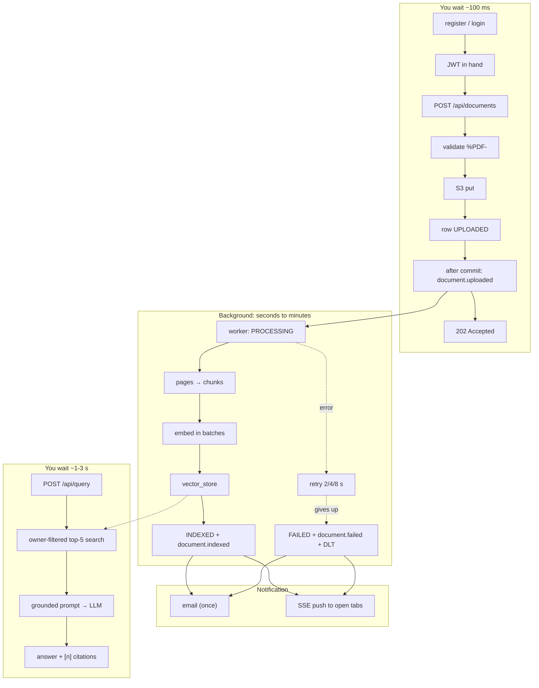

---

## 6. Project folder structure

```text
documind/
├── pom.xml                      Root Maven build: lists modules, pins every library version
├── Dockerfile                   One recipe that builds any service's image (MODULE build arg)
├── .env.example                 Template for your local secrets (copy to .env)
├── README.md                    Short project overview
├── docs/
│   └── DOCUMIND_GUIDE.md        This guide
│
├── common/                      Shared library (a plain jar, not a runnable service)
│   └── src/main/java/com/documind/common/
│       ├── events/              Kafka event records + topic names (the "contract" between services)
│       └── web/                 RequestIdFilter + auto-configuration that installs it everywhere
│
├── auth-service/                Users, passwords, JWT issuing, JWKS
│   └── src/main/
│       ├── java/com/documind/auth/
│       │   ├── config/          Key loading, JWT encoder/decoder, security rules, BCrypt
│       │   ├── service/         Register/login logic, token creation, exceptions
│       │   ├── user/            User entity + repository
│       │   └── web/             REST controllers, request/response records, error mapping
│       └── resources/
│           ├── application*.yml Configuration (default + docker + aws profiles)
│           └── db/migration/    Flyway SQL (users table)
│
├── gateway-service/             Public entry point (reactive)
│   └── src/main/java/com/documind/gateway/
│       ├── SecurityConfig.java       Which paths are public, how tokens are verified
│       └── RequestIdGlobalFilter.java  Adds X-Request-Id
│   (routes live in application.yml)
│
├── ingestion-service/           Upload API + Kafka worker
│   └── src/main/
│       ├── java/com/documind/ingestion/
│       │   ├── config/          Kafka topics + error handling, S3 client, security, AWS properties
│       │   ├── document/        REST API: controller, service, entity, repository, after-commit relay
│       │   └── worker/          Kafka consumer, PDF chunker, failure handler
│       └── resources/
│           ├── application*.yml (default, docker, aws, bedrock)
│           └── db/migration/    V1 documents table, V2 vector_store table + indexes
│
├── query-service/               RAG question answering
│   └── src/main/java/com/documind/query/
│       ├── config/              ChatClient bean, query tuning properties, security
│       └── rag/                 Controller, retrieval (owner filter), RAG prompt + LLM call, errors
│
├── notification-service/        Email + live push
│   └── src/main/
│       ├── java/com/documind/notification/
│       │   ├── config/          Security (accepts ?access_token= for SSE)
│       │   ├── email/           EmailSender interface + SMTP implementation
│       │   ├── events/          Kafka listeners + processed-events store (idempotency)
│       │   └── sse/             Stream endpoint + SseHub (open connections per user)
│       └── resources/db/migration/  processed_events table
│
├── infra/
│   ├── docker-compose.yml       Infrastructure: Postgres, Kafka, Kafka UI, LocalStack, Mailpit, Jaeger
│   ├── docker-compose.apps.yml  The five services (layered on top of the file above)
│   ├── init-db.sql              Creates the three databases, the read-only role, pgvector
│   ├── localstack-init.sh       Creates the S3 bucket when LocalStack starts
│   ├── create-topics.sh         Optional: create Kafka topics by hand
│   └── ecs/*.json               AWS ECS task definitions (one per service)
│
├── scripts/
│   ├── gen-keys.sh              Generates the RSA key pair for signing JWTs → secrets/
│   └── e2e.sh                   End-to-end smoke test through the gateway
│
├── samples/sample.pdf           A PDF used by the e2e script
│
└── .github/workflows/
    ├── ci.yml                   Build + test on every push/PR; check every image builds
    └── deploy.yml               After CI passes on main: push images to ECR, deploy to ECS
```

**Convention inside each service:** `config/` holds wiring (beans, security, clients); feature packages hold the controller → service → repository chain. Every service has `*Application.java` as its entry point and `src/test/` with integration tests.

---

## 7. Service deep dives, file by file

### 7.1 `common` (shared library)

**Why it exists:** services talk through Kafka events. Producer and consumer must agree on the exact shape of each event. Putting those classes in one shared jar makes the contract a compile-time fact: change a field and every affected service fails to compile, rather than failing at runtime.

| File | Purpose |
| --- | --- |
| `events/Topics.java` | Topic name constants: `document.uploaded`, `document.indexed`, `document.failed`, `document.uploaded.DLT`. No typos possible. |
| `events/DocumentEvent.java` | Interface with the fields every event has (`documentId`, `ownerId`, `ownerEmail`, `fileName`). Lets the notification push listener handle any event type generically. |
| `events/DocumentUploadedEvent.java` | Sent by the upload API. Carries the S3 bucket and key so the worker can fetch the file. |
| `events/DocumentIndexedEvent.java` | Sent by the worker on success, with `chunkCount`. |
| `events/DocumentFailedEvent.java` | Sent when processing gives up, with `reason`. |
| `web/RequestIdFilter.java` | Servlet filter: reads `X-Request-Id` (or makes one), puts it into the logging context (**MDC**) so every log line includes it, echoes it in the response. |
| `web/CommonWebAutoConfiguration.java` + `META-INF/spring/...AutoConfiguration.imports` | Spring Boot **auto-configuration**: any servlet-based service that depends on `common` gets the filter installed automatically, with no code in the service. It is skipped in the reactive gateway (`@ConditionalOnWebApplication(type = SERVLET)`), which has its own filter. |

Dependencies are marked `optional`, so `common` does not force a web stack onto anyone.

### 7.2 `auth-service`

**Job:** the only service that knows passwords and the only one that can **create** tokens.

| File | What it does and why |
| --- | --- |
| `AuthApplication.java` | Entry point. `@ConfigurationPropertiesScan` binds `JwtProperties` from YAML. |
| `config/JwtProperties.java` | Typed config under `jwt.*`: key contents or file paths, TTL (default 1 h), issuer, key id. |
| `config/JwtKeyConfig.java` | Loads the RSA key pair, in priority order: **(1)** PEM text from env vars `JWT_PRIVATE_KEY` / `JWT_PUBLIC_KEY` (used on AWS, injected from Secrets Manager); **(2)** files at `JWT_PRIVATE_KEY_PATH` / `JWT_PUBLIC_KEY_PATH` (used locally, made by `gen-keys.sh`); **(3)** neither: generate a temporary key pair and log a warning (fine for tests; tokens become invalid after a restart). Builds the `JwtEncoder` (signs) and a `JwtDecoder` (so `/auth/me` can verify its own tokens). |
| `config/SecurityConfig.java` | Public: register, login, JWKS, health. Everything else needs a token. CSRF disabled and sessions **stateless**: there are no cookies, so CSRF attacks do not apply, and no server memory per user. Defines the BCrypt `PasswordEncoder`. |
| `service/AuthService.java` | Register (normalise email, duplicate check, race-safe) and login (constant-time-ish failure, dummy hash). |
| `service/TokenService.java` | Builds claims and signs the JWT (RS256 with `kid`). |
| `service/*Exception.java` | `EmailAlreadyUsedException` → 409. `InvalidCredentialsException` → 401, one message for both failure cases. |
| `user/User.java` | JPA entity for `users`. Constructor is `protected` and creation goes through `User.create(...)`, so a user can never be built half-initialised. |
| `user/UserRepository.java` | Spring Data: `findByEmail`, `existsByEmail` generated from method names. |
| `web/AuthController.java` | `POST /auth/register` (201), `POST /auth/login`, `GET /auth/me` (reads claims straight from the token, no DB hit). |
| `web/AuthDtos.java` | Request/response records with validation annotations. |
| `web/JwksController.java` | `GET /.well-known/jwks.json` returns **only the public half** of the key (`rsaKey.toPublicJWK()`). The test asserts `isPrivate()` is false. |
| `web/GlobalExceptionHandler.java` | Exception → ProblemDetail status mapping. |
| `db/migration/V1__users.sql` | `users` table: UUID id, unique email, password hash, name, role, created_at. |

**Why RS256 (asymmetric) and not HS256 (one shared secret)?** With a shared secret, every service that verifies tokens could also *forge* them, and the secret must be copied everywhere. With RS256 only auth holds the private key; the other four only ever see the public key, which is safe to publish.

### 7.3 `gateway-service`

**Job:** the front door. It holds no data and no business logic.

| File | What it does |
| --- | --- |
| `GatewayApplication.java` | Entry point. |
| `application.yml` → `spring.cloud.gateway...routes` | Four routes: `/auth/**` → auth; `/api/documents`, `/api/documents/**` → ingestion; `/api/query`, `/api/query/**`, `/api/chat/**` → query; `/api/notifications/**` → notification. Target URLs come from env vars (`AUTH_URL`, `INGESTION_URL`...) with localhost defaults. (The YAML comment notes that the patterns for one route must be in **one** `Path=` predicate; two separate `Path` entries would both have to match.) |
| `application.yml` → `globalcors` | **CORS**: browsers block a web page on one origin from calling an API on another unless the API allows it. The default allowed origin is `http://localhost:5173` (the usual dev server port of a Vite/React front end). `X-Request-Id` is exposed so browser code can read it. |
| `SecurityConfig.java` | Reactive security. Public: `OPTIONS` (CORS pre-flight requests), register, login, health. Everything else: valid JWT. Tokens accepted from the header **or** `?access_token=` (for browser SSE). The decoder fetches the JWKS from `${AUTH_URL}/.well-known/jwks.json` and also checks `iss = documind-auth`. |
| `RequestIdGlobalFilter.java` | Runs first on every request: reuses an incoming `X-Request-Id` or creates a UUID, adds it to the forwarded request and to the response. |

The gateway passes the `Authorization` header through unchanged, so downstream services can verify the same token themselves.

### 7.4 `ingestion-service`

**Job:** everything about getting documents **in**: the upload API and the background worker. They live in one deployable because they share the `documents` table and the S3 bucket. If needed, the worker could later run as separate instances of the same image.

**`config/` package**

| File | What it does |
| --- | --- |
| `AwsProperties.java` | Typed config `aws.region`, `aws.s3.bucket`, `aws.s3.endpoint`. |
| `S3Config.java` | Builds the `S3Client`. If an endpoint is set (LocalStack): override URL, **path-style** addressing (`http://host/bucket/key`, which LocalStack needs), dummy credentials. If not (AWS): default credential chain, which finds the ECS task role. |
| `KafkaConfig.java` | Declares the four topics (3 partitions, replicas from config) so a fresh broker gets them automatically. Builds the error handler: exponential back-off retries, non-retryable exceptions, mark-failed + `document.failed` + dead-letter recovery. |
| `SecurityConfig.java` | Every request needs a valid token; JWKS from auth; issuer check. |

**`document/` package (the API side)**

| File | What it does |
| --- | --- |
| `DocumentController.java` | `POST` (202), `GET` list, `GET /{id}`, `DELETE /{id}` (204). Always passes `CurrentUser.from(jwt)`. |
| `CurrentUser.java` | The caller's id and email, taken from the verified token only. |
| `DocumentService.java` | Upload (validate, S3 put, save row, publish in-memory event), list, get, delete. Explained in Flows C and I. |
| `DocumentEventRelay.java` | `@TransactionalEventListener(AFTER_COMMIT)`: forwards the in-memory event to Kafka only after the DB commit. Logs success with the partition, or the failure. |
| `DocumentRecord.java` | JPA entity for `documents`. Named `DocumentRecord` (not `Document`) to avoid clashing with Spring AI's `Document` class, which the worker also uses. |
| `DocumentRepository.java` | Owner-scoped finders plus three targeted `UPDATE` queries (`updateStatus`, `markIndexed`, `markFailed`). Each returns the number of rows changed, which the worker uses to detect deleted documents. |
| `DocumentStatus.java` | `UPLOADED`, `PROCESSING`, `INDEXED`, `FAILED`. |
| `DocumentDto.java` | What the API returns: never exposes internal fields like the S3 key or owner id. |
| `GlobalExceptionHandler.java`, `InvalidUploadException`, `DocumentNotFoundException` | 400 for bad uploads, 404 for missing or not-yours. |

**`worker/` package (the background side)**

| File | What it does |
| --- | --- |
| `IngestionWorker.java` | The Kafka consumer. Flow D: mark processing → download → chunk → delete old vectors → embed + store in batches → mark indexed → publish `document.indexed`. Records metrics. |
| `PdfChunker.java` | PDF bytes → per-page text → ~800-token chunks → each tagged with `owner_id`, `document_id`, `file_name`, `page_number`, `chunk_index`. Throws `InvalidPdfException` for unparseable or text-less PDFs. |
| `DocumentFailureHandler.java` | Mark `FAILED` + publish `document.failed`. Called by the Kafka error handler after retries are exhausted. |
| `InvalidPdfException.java` | Signals "the input itself is bad"; registered as not retryable. |

**Migrations**

- `V1__documents.sql`: the `documents` table + index on `(owner_id, created_at DESC)` for fast "my documents, newest first".
- `V2__vector_store.sql`: enables extensions (`vector`, `hstore`, `uuid-ossp`), creates `vector_store` with exactly the columns Spring AI's `PgVectorStore` expects (`id`, `content`, `metadata JSON`, `embedding VECTOR(n)`), an **HNSW cosine** index for similarity search, and expression indexes on `metadata->>'owner_id'` and `metadata->>'document_id'` so owner filtering and per-document deletes are fast. `initialize-schema: false` tells Spring AI not to create the table itself, because Flyway owns the schema.

### 7.5 `query-service`

**Job:** turn a question into a grounded, cited answer. It writes nothing; it only reads vectors.

| File | What it does |
| --- | --- |
| `QueryApplication.java` | Entry point. |
| `config/AiConfig.java` | Builds a `ChatClient` from the auto-configured builder: OpenAI or Bedrock Converse, whichever profile is active. |
| `config/QueryProperties.java` | `defaultTopK` 5, `maxTopK` 20, `similarityThreshold` 0.35 (overridable via `SIMILARITY_THRESHOLD`). |
| `config/SecurityConfig.java` | Token required for everything except health. |
| `rag/QueryController.java` | `POST /api/query` (JSON) and `GET /api/chat/stream` (SSE). Validates inputs. |
| `rag/QueryDtos.java` | `QueryRequest`, `Source`, `QueryResponse` records with limits (question ≤ 2,000 chars, ≤ 50 document ids, topK 1–20). |
| `rag/RetrievalService.java` | Owner-scoped (and optionally document-scoped) similarity search. The tenant-isolation control. |
| `rag/RagService.java` | System prompt, numbered context, LLM call (blocking or streaming), sources with snippets, skip-LLM-when-empty, token and latency metrics. |
| `rag/GlobalExceptionHandler.java` | AI busy → 503 with a friendly message; AI rejected → 502. |

**Database access:** connects to `ingestion_db` as user `query_ro`, which has only `SELECT` rights, and the connection pool is set `read-only: true`. Even a bug in the query service cannot modify or delete vectors.

**Must match ingestion:** the embedding model and `EMBEDDING_DIMENSIONS` must be the same in both services, otherwise question vectors and chunk vectors live in different "spaces" and similarity is meaningless.

### 7.6 `notification-service`

**Job:** tell users what happened, by email and live push, exactly once per event for email.

| File | What it does |
| --- | --- |
| `NotificationApplication.java` | Entry point. `@EnableScheduling` turns on the heartbeat timer. |
| `config/SecurityConfig.java` | Token required; also accepted as `?access_token=` because browser `EventSource` cannot send headers. |
| `email/EmailSender.java` | Interface: `send(to, subject, body)`. |
| `email/SmtpEmailSender.java` | Plain-text email via `JavaMailSender`. From address `DocuMind <no-reply@documind.local>` by default (`MAIL_FROM`). |
| `events/DocumentEventsListener.java` | Three listeners: indexed-email, failed-email (shared group, idempotent) and push (unique group per instance). Flow H. |
| `events/ProcessedEventStore.java` | `alreadyProcessed(key)` / `markProcessed(key)` against `processed_events`; insert uses `ON CONFLICT DO NOTHING` so concurrent inserts never error. |
| `sse/NotificationController.java` | `GET /api/notifications/stream` → registers an `SseEmitter` for the caller. |
| `sse/SseHub.java` | In-memory map of open connections per user, send to user, 25-second heartbeat, cleanup on completion/timeout/error. |
| `db/migration/V1__processed_events.sql` | `processed_events(event_key PRIMARY KEY, processed_at)`. |

---

## 8. Data: databases, tables, Kafka topics, S3

### 8.1 Databases

One PostgreSQL server (locally, one container) hosts three databases, created by `infra/init-db.sql` the first time the data volume is created:

| Database | Owner service | Tables | Who else reads it |
| --- | --- | --- | --- |
| `auth_db` | auth | `users` | nobody |
| `ingestion_db` | ingestion | `documents`, `vector_store` | query (`vector_store`, read-only via `query_ro`) |
| `notification_db` | notification | `processed_events` | nobody |

`init-db.sql` also:

- creates the role `query_ro` (password `query_ro` locally) with `CONNECT` on `ingestion_db`,
- enables the `vector` extension in `ingestion_db`,
- uses `ALTER DEFAULT PRIVILEGES ... GRANT SELECT ON TABLES TO query_ro`, so tables that Flyway creates **later** are automatically readable by `query_ro`.

Tables themselves are created by each service's **Flyway** migrations at startup. Flyway also adds its own `flyway_schema_history` table in each database.

### 8.2 Tables

**`auth_db.users`**

| Column | Type | Notes |
| --- | --- | --- |
| `id` | UUID, primary key | Becomes the JWT `sub` and the `owner_id` everywhere |
| `email` | VARCHAR(255), UNIQUE | Stored lower-case |
| `password_hash` | VARCHAR(100) | BCrypt hash (never the password) |
| `full_name` | VARCHAR(255) | Optional |
| `role` | VARCHAR(20) | `USER` |
| `created_at` | TIMESTAMPTZ | |

**`ingestion_db.documents`** (one row per uploaded PDF)

| Column | Notes |
| --- | --- |
| `id` | Document UUID, also the Kafka message key |
| `owner_id` | The uploader's user id |
| `file_name`, `content_type`, `size_bytes` | From the upload |
| `s3_key` | `{ownerId}/{documentId}.pdf` |
| `status` | `UPLOADED` / `PROCESSING` / `INDEXED` / `FAILED` |
| `chunk_count` | Set when indexed |
| `error` | Reason when failed |
| `created_at`, `updated_at` | |

**`ingestion_db.vector_store`** (one row per chunk)

| Column | Example |
| --- | --- |
| `id` | UUID |
| `content` | "Either party may terminate this agreement with thirty (30) days written notice..." |
| `metadata` (JSON) | `{"owner_id":"…","document_id":"…","file_name":"contract.pdf","page_number":1,"chunk_index":0}` |
| `embedding` | `VECTOR(1536)`: `[0.0123, -0.0456, …]` (1,536 numbers) |

Indexes: HNSW on `embedding` (cosine), and on `metadata->>'owner_id'` and `metadata->>'document_id'`.

**`notification_db.processed_events`**

| Column | Example |
| --- | --- |
| `event_key` (PK) | `document.indexed:7f3c…` |
| `processed_at` | timestamp |

### 8.3 Document status lifecycle

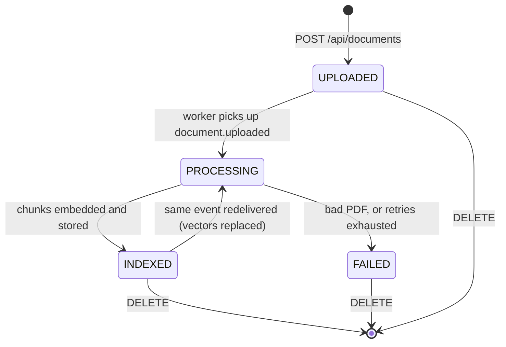

### 8.4 Kafka topics and events

All topics: **3 partitions**, key = document id, value = JSON.

| Topic | Producer | Consumers | Payload fields |
| --- | --- | --- | --- |
| `document.uploaded` | ingestion API (after commit) | ingestion worker (group `ingestion-workers`) | documentId, ownerId, ownerEmail, s3Bucket, s3Key, fileName, contentType, uploadedAt |
| `document.indexed` | ingestion worker | notification (`notification-email`, `notification-push-<uuid>`) | documentId, ownerId, ownerEmail, fileName, chunkCount, indexedAt |
| `document.failed` | ingestion error handler | notification (both groups) | documentId, ownerId, ownerEmail, fileName, reason, failedAt |
| `document.uploaded.DLT` | ingestion error handler | humans (Kafka UI), for inspection and replay | the original `document.uploaded` message |

Producer settings in ingestion: `acks: all` (the broker confirms only after all in-sync replicas have the message) and `enable.idempotence: true` (the producer's own retries never write duplicates). Together they make sends as safe as Kafka allows.

### 8.5 S3

- Bucket: `documind-uploads` (`S3_BUCKET`). Created locally by `infra/localstack-init.sh`.
- Key layout: `<ownerId>/<documentId>.pdf`.
- Written on upload, read by the worker, deleted on document delete.

---

## 9. Configuration, profiles and environment variables

### 9.1 How Spring config works here

Each service has `src/main/resources/application.yml`. Values look like `${DB_HOST:localhost}`, meaning **"use the environment variable `DB_HOST` if set, otherwise `localhost`"**. That single pattern lets the same jar run:

- from your IDE (defaults point at `localhost`),
- in Docker Compose (env vars point at container names like `postgres`, `kafka`),
- on AWS (env vars from the ECS task definition and Secrets Manager).

**Profiles** layer extra files on top, chosen with `SPRING_PROFILES_ACTIVE`:

| Profile | File | Effect |
| --- | --- | --- |
| (default) | `application.yml` | Localhost defaults; IDE development |
| `docker` | `application-docker.yml` | DB URL uses host `postgres`; notification's mail host `mailpit`; JSON (ECS-format) logs |
| `aws` | `application-aws.yml` | JSON logs (connection settings come from env vars) |
| `bedrock` | `application-bedrock.yml` (ingestion, query) | Switch AI provider to Amazon Bedrock (Titan embeddings, Converse chat) |

### 9.2 Environment variables

| Variable | Used by | Default | Purpose |
| --- | --- | --- | --- |
| `OPENAI_API_KEY` | ingestion, query | empty | OpenAI key (**required** for real runs) |
| `OPENAI_BASE_URL` | ingestion, query | `https://api.openai.com` | Any OpenAI-compatible endpoint |
| `OPENAI_CHAT_MODEL` | query | `gpt-4o-mini` | Chat model |
| `OPENAI_EMBEDDING_MODEL` | ingestion, query | `text-embedding-3-small` | Must match in both |
| `EMBEDDING_DIMENSIONS` | ingestion, query | `1536` | Vector size; must match the model |
| `EMBEDDING_PROVIDER`, `CHAT_PROVIDER` | ingestion, query | `openai` | Spring AI model selection |
| `BEDROCK_CHAT_MODEL` | query (bedrock profile) | – | Bedrock model or inference-profile id |
| `SIMILARITY_THRESHOLD` | query | `0.35` | Minimum relevance of a chunk |
| `DB_HOST`, `DB_PORT`, `DB_USERNAME`, `DB_PASSWORD` | auth, ingestion, query, notification | `localhost`, `5432`, `documind`/`query_ro` | Database connection |
| `KAFKA_BOOTSTRAP` | ingestion, notification | `localhost:9092` | Kafka address |
| `KAFKA_REPLICAS` | ingestion | `1` | Topic replication (higher on MSK) |
| `AUTH_URL` | all except auth | `http://localhost:8081` | Where to fetch the JWKS (and gateway route target) |
| `INGESTION_URL`, `QUERY_URL`, `NOTIFICATION_URL` | gateway | `http://localhost:808x` | Route targets |
| `CORS_ALLOWED_ORIGINS` | gateway | `http://localhost:5173` | Allowed browser origin |
| `JWT_PRIVATE_KEY`, `JWT_PUBLIC_KEY` | auth | empty | PEM contents (AWS, from Secrets Manager) |
| `JWT_PRIVATE_KEY_PATH`, `JWT_PUBLIC_KEY_PATH` | auth | empty | PEM file paths (local) |
| `S3_BUCKET`, `S3_ENDPOINT`, `AWS_REGION` | ingestion | `documind-uploads`, `http://localhost:4566`, `us-east-1` | S3 settings; set `S3_ENDPOINT` empty on AWS |
| `SMTP_HOST`, `SMTP_PORT`, `SMTP_USERNAME`, `SMTP_PASSWORD`, `SMTP_AUTH`, `SMTP_STARTTLS`, `MAIL_FROM` | notification | `localhost`, `1025`, … | Email settings |
| `TRACING_ENABLED`, `OTLP_ENDPOINT` | all | `false`, `http://localhost:4318/v1/traces` | Distributed tracing |
| `SERVER_PORT` | all | 8080–8084 | HTTP port |

### 9.3 Secrets

- **Locally:** `.env` (from `.env.example`) holds `OPENAI_API_KEY`; `scripts/gen-keys.sh` writes `secrets/jwt-private.pem` and `secrets/jwt-public.pem`. Both `.env` and `secrets/` are in `.gitignore` and `.dockerignore`, so they are never committed or baked into images. Compose mounts `../secrets` into the auth container read-only.
- **On AWS:** values live in **Secrets Manager** (`documind/db`, `documind/jwt`, `documind/openai`, `documind/ses`) and the ECS task definition's `secrets` block injects them as environment variables when the container starts. Nothing secret is in the image or in Git.

---

## 10. Security model

| Threat | Defence | Where |
| --- | --- | --- |
| Stolen database reveals passwords | BCrypt hashes, never plain passwords | `auth-service` `SecurityConfig`, `AuthService` |
| Attacker learns which emails have accounts | Identical 401 for unknown email and wrong password, with equalised timing | `AuthService.login`, `InvalidCredentialsException` |
| Forged tokens | RS256 signature; only auth holds the private key; issuer and expiry checked | `JwtKeyConfig`, every `SecurityConfig` |
| A service reached directly, bypassing the gateway | Every service verifies the JWT itself | `SecurityConfig` in each service |
| User A reads User B's document | Every query filters by `owner_id` from the token; other users' ids return 404 | `DocumentRepository.findByIdAndOwnerId`, `RetrievalService` |
| User A's question answered from User B's PDFs | `owner_id` metadata filter on every vector search (tested) | `RetrievalService` |
| Uploading non-PDF or huge files | `%PDF-` magic-byte check, 25 MB limit | `DocumentService.validatePdf`, `application.yml` |
| Path tricks in filenames | Filename stripped to its last segment, length capped | `DocumentService.cleanFileName` |
| Malicious JSON in Kafka creating arbitrary classes | `spring.json.trusted.packages` restricted to `com.documind.common.events` | ingestion/notification `application.yml` |
| Query service bug corrupts data | Read-only DB role and read-only connection pool | `init-db.sql`, query `application.yml` |
| LLM inventing facts | Strict system prompt, citations required, LLM skipped when nothing relevant is found, low temperature | `RagService` |
| Internal services exposed to the internet | Only the gateway publishes a port (Compose) / sits behind the ALB (AWS) | `docker-compose.apps.yml`, ECS setup |
| Leaked cloud credentials | No AWS keys anywhere: ECS task roles for S3/Bedrock; GitHub OIDC for deploys | `S3Config`, `deploy.yml` |
| Containers running as root | Runtime image creates and uses a non-root `app` user | `Dockerfile` |

**A note on `?access_token=`:** allowing tokens in the URL is needed for browser SSE, but URLs can end up in logs. Tokens expire in one hour, which limits the damage. A production UI might prefer fetch-based SSE with headers.

---

## 11. Reliability: retries, idempotency, dead letters

Distributed systems fail in partial, messy ways. These are the patterns DocuMind uses and the problem each solves:

| Pattern | Problem it solves | Where |
| --- | --- | --- |
| **Asynchronous processing via Kafka** | Slow work would block users and break on timeouts | upload → `document.uploaded` → worker |
| **Publish after commit** | Consumers seeing events for rows that were rolled back | `DocumentEventRelay` (`AFTER_COMMIT`) |
| **At-least-once delivery** | Messages are never lost, but may arrive twice | Kafka + `ack-mode: record` |
| **Idempotent consumer: delete-then-insert** | A duplicate `document.uploaded` would duplicate vectors | `IngestionWorker` |
| **Idempotent consumer: processed-events table** | A duplicate `document.indexed` would send a second email | `ProcessedEventStore` |
| **Retry with exponential back-off** | Temporary failures (network, rate limits) | `KafkaConfig`, `spring.ai.retry` |
| **Non-retryable exceptions** | Wasting time retrying a broken PDF | `addNotRetryableExceptions(...)` |
| **Dead-letter topic** | Failed messages disappearing without a trace | `document.uploaded.DLT` |
| **Explicit FAILED status + event** | Users left waiting forever without knowing | `DocumentFailureHandler` |
| **Partition key = document id** | Events for one document processed out of order | all `kafka.send(..., documentId, ...)` |
| **Health / readiness probes** | Traffic sent to a service that is not ready yet | Actuator + Compose/ECS health checks |
| **Mail health excluded** | An email outage taking the whole notification service offline | `management.health.mail.enabled: false` |
| **SSE heartbeats** | Load balancers closing idle live connections | `SseHub.heartbeat` |

**Known gap (documented, on the roadmap):** if the DB commit succeeds but the Kafka send fails, the document stays `UPLOADED`. The **transactional outbox** pattern fixes this by writing the event into an `outbox` table inside the same transaction, then relaying it to Kafka separately.

---

## 12. Observability: health, metrics, logs, traces

**Health.** Every service exposes `/actuator/health`, plus `/actuator/health/liveness` (is the process alive? if not, restart it) and `/actuator/health/readiness` (can it serve traffic yet?). Compose waits on readiness before starting dependents; ECS uses liveness to replace sick containers.

**Metrics.** `/actuator/prometheus` exposes standard JVM, HTTP, DB pool and Kafka metrics, plus DocuMind-specific ones:

| Metric | Type | Meaning |
| --- | --- | --- |
| `documind.ingestion.duration` | timer | Time to download, chunk, embed and store one document |
| `documind.chunks.created` | counter | Total chunks indexed |
| `documind.query.latency` | timer | Time to answer a question |
| `documind.llm.tokens{model=...}` | counter | Tokens consumed per model, which tracks cost |

A Prometheus server (not included) can scrape these and Grafana can chart them.

**Logs.** Each log line carries `[service-name, traceId, requestId]` thanks to the `logging.pattern.correlation` setting and the request-id filters. In the `docker` and `aws` profiles logs are JSON (Elastic Common Schema), which CloudWatch Logs and similar tools can search by field.

**Traces.** With `TRACING_ENABLED=true` (set automatically in Compose), Micrometer Tracing + OpenTelemetry send spans to Jaeger. A single upload can be followed in Jaeger's UI (http://localhost:16686) from the gateway, into ingestion, across Kafka (`observation-enabled: true` on listeners and templates propagates the trace through message headers) and into the worker and notification service.

---

## 13. Running it on your machine

### 13.1 Prerequisites

| Tool | Why | Check |
| --- | --- | --- |
| JDK 17 | Compile and run Java | `java -version` |
| Maven 3.9+ | Build | `mvn -v` |
| Docker Desktop | Run infra and services, and tests | `docker version` |
| Git Bash (on Windows) | The `scripts/*.sh` are bash scripts | `bash --version` |
| OpenSSL | Generate JWT keys (bundled with Git Bash) | `openssl version` |
| OpenAI API key | Embeddings and answers | platform.openai.com |

### 13.2 Start everything (full stack in Docker)

```bash
# 1. Secrets
cp .env.example .env              # then edit .env and set OPENAI_API_KEY=sk-...
scripts/gen-keys.sh               # creates secrets/jwt-private.pem and jwt-public.pem

# 2. Build and start infrastructure + all five services
cd infra
docker compose -f docker-compose.yml -f docker-compose.apps.yml up -d --build

# 3. Prove it works end to end
cd ..
scripts/e2e.sh
```

What happens during step 2:

1. The root `Dockerfile` is built five times with different `MODULE` values. **Stage 1** (Maven image) compiles only that module and the modules it depends on (`-pl ${MODULE} -am`), with a cache mount so dependencies are not re-downloaded. It then splits the Spring Boot jar into **layers** (dependencies, loader, snapshot dependencies, application). **Stage 2** (small JRE Alpine image) copies the layers least-changed first, so a code change rebuilds only the thin last layer. The container runs as non-root user `app`, and `MaxRAMPercentage=75` lets Java size its memory to the container's limit.
2. Compose starts Postgres (running `init-db.sql` on first start), Kafka, LocalStack (creating the bucket), Mailpit, Jaeger and Kafka UI.
3. Services start in dependency order, each waiting for its dependencies' health checks: auth after Postgres; ingestion after Postgres, Kafka, LocalStack and auth; query after **ingestion** (because ingestion's Flyway creates `vector_store`); notification after Postgres, Kafka and auth; gateway after auth.
4. Only the gateway publishes a port (8080), mirroring production where the others live in private subnets.

What `scripts/e2e.sh` checks, using only `bash` and `curl`:

1. `GET /api/documents` without a token → `401`.
2. Register a random new user → `201`.
3. Log in → a token is returned.
4. Upload `samples/sample.pdf` → an id is returned.
5. Poll the document every 2 s (up to 180 s) until `INDEXED` (fails fast on `FAILED`).
6. Ask *"How many days notice is required to terminate the agreement?"* and assert the answer cites `sample.pdf`.
7. Delete the document → `204`.

### 13.3 Useful local web pages

| What | URL | Use it to |
| --- | --- | --- |
| API (gateway) | http://localhost:8080 | All API calls |
| Kafka UI | http://localhost:8090 | Browse topics, see events, inspect the DLT |
| Mailpit | http://localhost:8025 | Read the "document ready / failed" emails |
| Jaeger | http://localhost:16686 | See request traces across services |

### 13.4 Try the API by hand

```bash
# Register and log in
curl -X POST localhost:8080/auth/register -H 'Content-Type: application/json' \
  -d '{"email":"me@example.com","password":"Passw0rd!","fullName":"Me"}'
TOKEN=$(curl -s -X POST localhost:8080/auth/login -H 'Content-Type: application/json' \
  -d '{"email":"me@example.com","password":"Passw0rd!"}' | sed -n 's/.*"accessToken":"\([^"]*\)".*/\1/p')

# In a second terminal: watch live status events
curl -N -H "Authorization: Bearer $TOKEN" localhost:8080/api/notifications/stream

# Upload, list, ask, stream
curl -H "Authorization: Bearer $TOKEN" -F file=@samples/sample.pdf localhost:8080/api/documents
curl -H "Authorization: Bearer $TOKEN" localhost:8080/api/documents
curl -H "Authorization: Bearer $TOKEN" -H 'Content-Type: application/json' localhost:8080/api/query \
  -d '{"question":"How many days notice is needed to terminate?"}'
curl -N -H "Authorization: Bearer $TOKEN" "localhost:8080/api/chat/stream?q=What%20are%20the%20payment%20terms"
```

(`curl -N` disables buffering so streamed events appear as they arrive.)

### 13.5 Developing one service from your IDE

1. Start only the infrastructure: `cd infra && docker compose up -d`.
2. Start the services you need with Maven, e.g. `mvn -pl auth-service spring-boot:run`, or run the `*Application` class from IntelliJ/VS Code. The defaults already point to `localhost`.
3. Set environment variables in your run configuration: `OPENAI_API_KEY` for ingestion and query; `JWT_PRIVATE_KEY_PATH=../secrets/jwt-private.pem` and `JWT_PUBLIC_KEY_PATH=../secrets/jwt-public.pem` for auth (paths relative to the module folder).
4. Start auth first: the others fetch its public key.

### 13.6 Troubleshooting

| Symptom | Likely cause | Fix |
| --- | --- | --- |
| Port already in use | Another Postgres/Kafka/app on 5432/9092/8080 | Create `infra/.env` with `PG_PORT=15432`, `KAFKA_PORT=19092`, `GATEWAY_PORT=18080`, … and run `BASE_URL=http://localhost:18080 scripts/e2e.sh` |
| Every call returns 401 | Token expired (1 h), or auth restarted without fixed keys | Log in again; make sure `gen-keys.sh` was run so keys persist |
| Document goes to `FAILED` with "No extractable text" | Scanned/image PDF | OCR is not supported yet (roadmap) |
| Document goes to `FAILED` mentioning an API key / 401 | Missing or wrong `OPENAI_API_KEY` | Fix `.env`, restart ingestion and query |
| Query returns 503 | OpenAI rate limit or outage | Wait and retry |
| Answer is always "I could not find this…" | Nothing passed the 0.35 similarity threshold, or the document is not `INDEXED` yet | Check status; rephrase; lower `SIMILARITY_THRESHOLD` |
| Errors about vector dimensions | Embedding model changed but the table kept the old size | Use a fresh database (`docker compose down -v`) and re-index |
| `init-db.sql` changes not applied | It only runs when the Postgres volume is first created | `docker compose down -v` (this deletes all local data) |
| Scripts fail on Windows | Running in PowerShell/CMD | Run them in Git Bash |

---

## 14. Testing

Run all tests with:

```bash
mvn verify        # Docker must be running
```

The suite has **26 integration tests**. "Integration" means they start the real Spring application and talk to real infrastructure in throwaway containers, rather than mocking everything:

| Ingredient | Why |
| --- | --- |
| **Testcontainers PostgreSQL** (`pgvector/pgvector:pg16` for ingestion/query) | Real SQL, real Flyway migrations, real vector search |
| **Testcontainers LocalStack** | Real S3 API calls |
| **`@EmbeddedKafka` (KRaft)** | Real Kafka produce/consume, retries and DLT |
| **`FakeEmbeddingModel`** | Deterministic, free "embedding": each word is hashed into one of 1,536 slots and the vector normalised. Texts sharing words land close together, which is all retrieval tests need. No OpenAI calls, no cost, same result every run. |
| **`StubChatModel`** (query) | A fake LLM, so tests check the prompt and citations without paying for or depending on a real model |
| **`TestPdfs`** | Builds small PDFs in code with PDFBox (a two-page "Master Services Agreement" with termination on page 1 and payment on page 2), so page-number assertions are exact |
| **`@ServiceConnection`** | Spring Boot wires the container's URL/credentials into the app automatically |
| **Awaitility** | Waits (up to 60 s) for asynchronous results like status `INDEXED` |

What is covered:

| Service | Tests prove that… |
| --- | --- |
| auth | register → login → the token verifies against the public JWKS (and the JWKS has no private part); duplicate email → 409; unknown email and wrong password return identical 401 bodies; bad input → 400; `/auth/me` without token → 401 |
| gateway | protected routes without token → 401; login is public and routed; authenticated requests are routed and get `X-Request-Id`; health is public |
| ingestion | upload → S3 → Kafka → chunks with correct page numbers and owner → `INDEXED` → `document.indexed` with the right chunk count; a corrupt PDF → `FAILED` + `document.failed` + DLT record; non-PDF → 400; users only see their own documents (other's id → 404); delete removes the row and all vectors; no token → 401 |
| query | answers cite sources; owner isolation (one user's chunks never reach another's prompt); `documentIds` filter; LLM not called without context; SSE event order (`sources`, `token`…, `done`); validation |
| notification | one email per event even when redelivered; failure email; SSE push reaches the user; auth required |

Reports: `*/target/surefire-reports/` (results) and `*/target/site/jacoco/index.html` (coverage).

---

## 15. CI/CD and deploying to AWS

### 15.1 Continuous Integration (`.github/workflows/ci.yml`)

Runs on every pull request and every push to `main`:

1. **build** job: checks out the code, installs Java 17 (with a Maven cache), runs `mvn -B verify` (all tests, using the GitHub runner's Docker for Testcontainers), and uploads test and coverage reports, even when tests fail.
2. **docker** job (after build passes): builds all five images in parallel (a matrix) to prove they build, without pushing. GitHub's build cache makes repeat builds fast.

`concurrency: cancel-in-progress` cancels an older run on the same branch when a new commit arrives.

### 15.2 Continuous Deployment (`.github/workflows/deploy.yml`)

Triggered when CI **succeeds** on `main` (or manually):

1. **Log in to AWS with OIDC.** GitHub issues a short-lived identity token; AWS trusts it only for this repository's `main` branch and lets it assume a deploy role. No AWS access keys are stored in GitHub.
2. For each service, **one at a time** (`max-parallel: 1`), in the order **auth → ingestion → query → notification → gateway**: auth first because everyone validates tokens against it, gateway last so it only routes to services already updated.
   1. Build the image for `linux/amd64` and push it to **ECR**, tagged with the commit SHA.
   2. Render the task definition `infra/ecs/<service>.json` with the new image.
   3. Deploy to the **ECS** service and **wait until it is stable** (new tasks healthy, old ones drained) before moving on.

### 15.3 The AWS target architecture

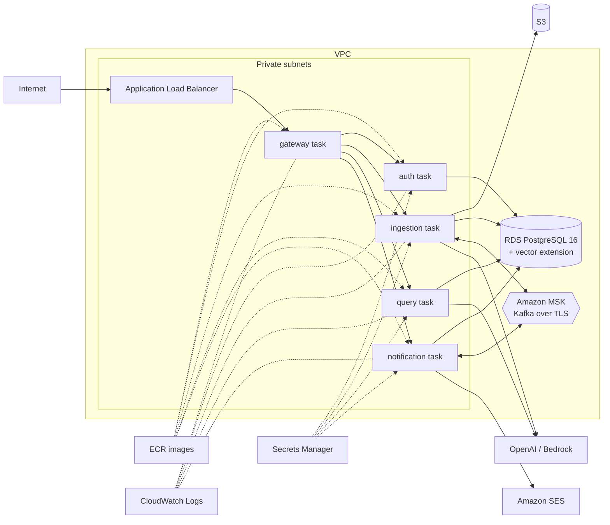

| AWS service | Role |
| --- | --- |
| **ECS Fargate** | Runs each service's container without managing servers. Task definitions (`infra/ecs/*.json`) set CPU/memory, env vars, secrets, health check and log destination. |
| **ECS Service Connect** | Lets services find each other by short names (`http://auth:8081`), as in Compose |
| **ALB** | Public HTTPS entry, forwarding only to the gateway |
| **RDS PostgreSQL 16** | Managed database, with `CREATE EXTENSION vector` |
| **MSK** | Managed Kafka (TLS, so `SPRING_KAFKA_SECURITY_PROTOCOL` is set in the task definitions) |
| **S3** | PDF storage, accessed with the ingestion task's IAM role |
| **SES** | Email delivery |
| **Secrets Manager** | DB passwords, JWT keys, OpenAI key, SES SMTP credentials |
| **ECR** | Image registry (`documind/<service>`) |
| **CloudWatch Logs** | Log groups `/ecs/documind/<service>` |
| **IAM** | `documind-ecs-execution` (pull images, read secrets) and one `documind-<service>-task` role each (what the app itself may access) |

Setup steps (from the README): create the infrastructure, run `init-db.sql` against RDS, store the secrets, replace the `<PLACEHOLDERS>` in `infra/ecs/*.json`, register the task definitions and create the five ECS services (auth first, gateway last), configure GitHub OIDC and the `AWS_DEPLOY_ROLE_ARN` secret, then run `BASE_URL=https://<your-domain> scripts/e2e.sh`.

**Cost note:** NAT gateway, ALB, RDS, MSK and five tasks cost roughly **$150–200 per month** if left running. Tear it down between demos.

---

## 16. Limitations and roadmap

| Limitation today | Planned improvement |
| --- | --- |
| Commit succeeds but Kafka send fails → document stuck `UPLOADED` | Transactional outbox |
| Scanned (image-only) PDFs fail | OCR with Amazon Textract |
| Pure semantic search can miss exact terms (codes, names) | Hybrid search (pgvector + PostgreSQL full-text `tsvector`) and re-ranking |
| Tokens last 1 hour, then the user must log in again | Refresh tokens |
| No protection against someone spamming expensive questions | Rate limiting on `/api/query` (Redis) |
| Each question is independent; no follow-ups like "and what about the fees?" | Conversation memory |
| No user interface | React front end (the CORS default `localhost:5173` is ready for it) |
| AWS resources created by hand | Terraform |

---

## 17. Glossary

| Term | Meaning |
| --- | --- |
| **Acknowledgement (ack)** | A consumer telling Kafka "I finished this message, don't send it again" |
| **Actuator** | Spring Boot module providing health, info and metrics endpoints |
| **ALB** | AWS Application Load Balancer: spreads incoming HTTP traffic over containers |
| **At-least-once delivery** | Every message is delivered, but occasionally more than once |
| **Auto-configuration** | Spring Boot creating beans automatically based on dependencies and config |
| **Back-off (exponential)** | Waiting longer between each retry (2 s, 4 s, 8 s…) |
| **Bean** | An object created and managed by Spring |
| **BCrypt** | Slow, salted password-hashing algorithm |
| **BOM** | Bill of Materials: a list of library versions known to work together |
| **Bucket / key (S3)** | A bucket is a top-level container; a key is a file's name/path inside it |
| **Chunk** | A small piece of a document's text that is embedded and searched |
| **Citation** | `[n]` in an answer pointing to a source chunk (file + page) |
| **Claim (JWT)** | A field inside a token, e.g. `sub`, `email`, `exp` |
| **Consumer group** | Kafka consumers sharing work; each message goes to one member of each group |
| **Cosine similarity** | How closely two vectors point in the same direction (1 = identical meaning) |
| **CORS** | Browser rule controlling which websites may call an API from JavaScript |
| **CSRF** | An attack using a victim's browser cookies; irrelevant without cookies, so disabled here |
| **Dead-letter topic (DLT)** | Where messages that could not be processed are parked for inspection |
| **Dependency injection** | A framework supplying a class with the objects it needs |
| **Docker image / container** | A packaged application / a running instance of it |
| **DTO** | Data Transfer Object: a simple class shaped for an API request/response |
| **ECS / Fargate** | AWS's container service / its serverless mode (no servers to manage) |
| **Embedding** | A vector of numbers representing the meaning of a text |
| **Entity** | A Java class mapped to a database table (JPA) |
| **Event** | A message stating a fact that happened ("document indexed") |
| **Flyway migration** | A versioned SQL script that evolves the database schema |
| **Gateway** | The single entry point that routes requests to services |
| **Grounded answer** | An answer built only from provided sources, not the model's general knowledge |
| **Hallucination** | An LLM stating something false with confidence |
| **HNSW** | Fast approximate-nearest-neighbour index for vectors |
| **Idempotent** | Doing it twice has the same effect as doing it once |
| **IAM role** | AWS identity granting permissions to a service without stored keys |
| **JPA / Hibernate** | Java standard / library for mapping objects to tables |
| **JWKS** | JSON Web Key Set: a URL publishing public keys for verifying tokens |
| **JWT** | JSON Web Token: a signed, self-contained identity token |
| **Kafka** | Durable, ordered, distributed message log |
| **KRaft** | Kafka's built-in consensus mode (no ZooKeeper) |
| **LLM** | Large Language Model, e.g. GPT-4o-mini |
| **LocalStack** | Local imitation of AWS services (here S3) |
| **Magic number** | Fixed bytes at the start of a file identifying its type (`%PDF-`) |
| **MDC** | Mapped Diagnostic Context: per-request values added to every log line |
| **Microservice** | A small, independently deployable service owning one capability |
| **Multipart upload** | HTTP format for sending files in a form (`-F file=@...`) |
| **OIDC** | OpenID Connect; here, GitHub proving its identity to AWS |
| **Partition** | A slice of a Kafka topic; messages with the same key go to the same partition, in order |
| **pgvector** | PostgreSQL extension for storing and searching vectors |
| **ProblemDetail** | Standard JSON format for HTTP errors |
| **Profile (Spring)** | A named set of configuration overrides (`docker`, `aws`, `bedrock`) |
| **Prompt / system prompt** | Text sent to an LLM / the part that sets its rules |
| **RAG** | Retrieval-Augmented Generation: retrieve relevant text, then let the LLM answer from it |
| **Reactive (Flux/Mono)** | Non-blocking programming with streams of values arriving over time |
| **Read model (shared)** | A table one service writes and another only reads |
| **Repository** | Data-access interface (Spring Data generates the implementation) |
| **RS256** | JWT signing with an RSA private key; verification with the public key |
| **SSE** | Server-Sent Events: a server streaming events over one open HTTP response |
| **Stateless** | The server keeps no per-user session; each request carries everything (the JWT) |
| **Temperature** | LLM randomness setting; low = consistent and factual |
| **Tenant isolation** | Guaranteeing one user's data never reaches another user |
| **Testcontainers** | Library starting real dependencies in Docker for tests |
| **Token (LLM)** | A unit of text (~¾ word) that models read, write and bill by |
| **Top-K** | Return the K most similar results (default 5) |
| **Topic** | A named stream of messages in Kafka |
| **Transaction** | A group of DB changes that succeed or fail together |
| **Transactional outbox** | Writing events to a DB table in the same transaction, then relaying them; closes the "commit OK, send failed" gap |
| **UUID** | Universally unique 128-bit id, e.g. `7f3c1e2a-…` |
| **Vector** | An ordered list of numbers; here, an embedding |
